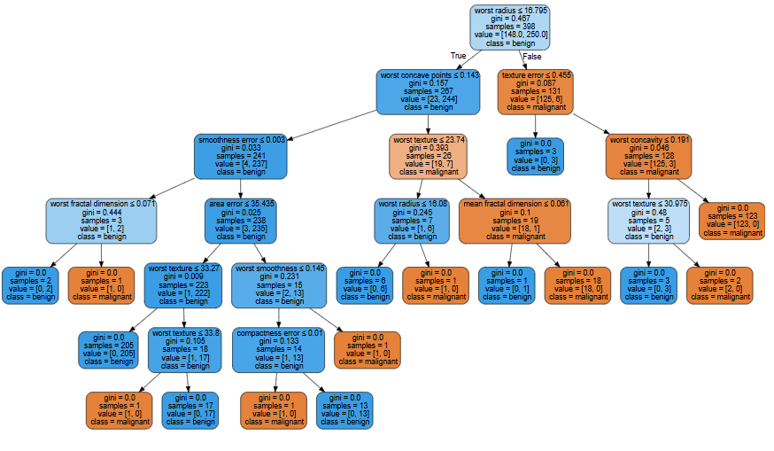
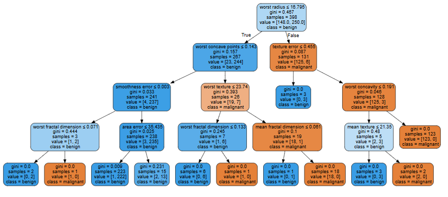
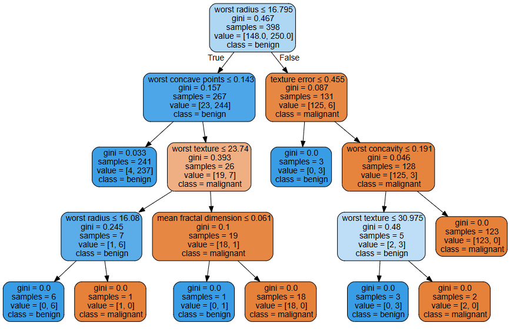
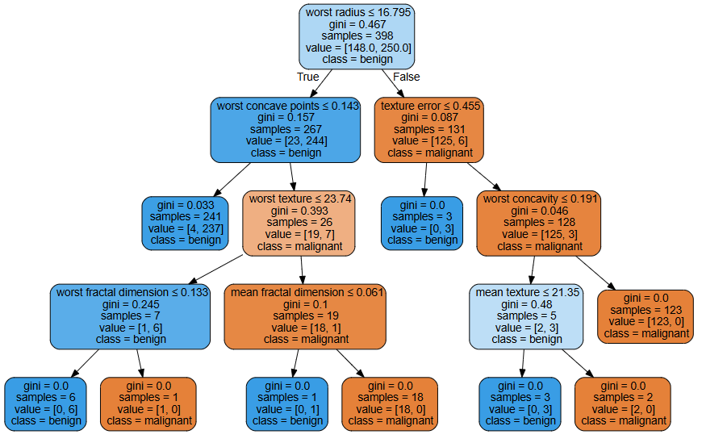
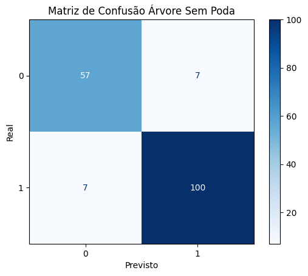

# Portuguese Version

## Explicações gerais

### Sobre o dataset
Esse conjunto de dados é usado para classificar **tumores de mama** como **malignos (cancerígenos)** ou **benignos (não cancerígenos)** com base em características extraídas de imagens de exames. É, portanto, um problema de classificação binária.

#### Estrutura do dataset:
- Contém 569 amostras, com 212 malígnas e 357 benignas.
- São analisados 30 atributos numéricos relacionados, por exemplo, a características dos tumores, como o raio, textura, perímetro, área, suavidade etc.

Para maior detalhamento sobre o dataset, acesse: 
https://scikit-learn.org/stable/modules/generated/sklearn.datasets.load_breast_cancer.html

### Sobre como o código foi estruturado
O código foi organizado para comparar o desempenho de diferentes estratégias de poda em árvores de decisão. 

As quatro abordagens avaliadas foram: 

**1. Sem poda** — **árvore cresce livremente** até encaixar totalmente os dados de treino.

**2. Pré-poda** — **limita a profundidade** da árvore **durante o treinamento** com o parâmetro **max_depth**.

**3. Pós-poda** — usa o parâmetro **ccp_alpha** para **simplificar** a árvore **após o treinamento**.

**4. Pré-poda e Pós-poda** — aplica **max_depth e ccp_alpha juntos**. 

Para cada estratégia, temos:
- Visualização da árvore.
- A acurácia no treino e no teste.
- Profundidade da árvore.
- O número total de nós.
- As matrizes de confusão.
- A importância de cada característica.

## Código

### Importar bibliotecas
``` python
import pandas as pd
from sklearn.datasets import load_breast_cancer
from sklearn.tree import DecisionTreeClassifier
from sklearn.model_selection import train_test_split
from sklearn.metrics import accuracy_score, confusion_matrix, ConfusionMatrixDisplay
import matplotlib.pyplot as plt
import graphviz 
```
- pandas (pd): Usada para manipulação e análise de dados em formato de tabelas (DataFrames).
- sklearn: scikit-learn (sklearn) é uma biblioteca em Python utilizada para Machine Learning. Nos permite treinar modelos, processar dados e avaliar seus desempenhos.

  - sklearn.datasets.load_breast_cancer:
Função para carregar o dataset Breast Cancer Wisconsin (Diagnostic), que contém dados para classificação de tumores.

  - sklearn.tree.DecisionTreeClassifier:
Implementa o modelo de Árvore de Decisão para classificação. Utilizado para treinar o classificador que vai prever se um tumor é benigno ou maligno.

  - sklearn.model_selection.train_test_split:
Função para dividir os dados em conjuntos de treino e teste.

  - sklearn.metrics.accuracy_score:
Métrica para calcular a acurácia (percentual de acertos) do modelo preditivo.

  - sklearn.metrics.confusion_matrix:
Métrica para calcular a matriz de confusão

  - sklearn.metrics.ConfusionMatrixDisplay:
Função utilizada para plotar e visualizar a matriz de confusão

- matplotlib.pyplot:
Módulo da biblioteca Matplotlib utilizado para a visualização de dados por meio de gráficos.

- graphviz:
Biblioteca utilizada para estruturar visualmente as árvores de decisão


### Carregar e preparar os dados
``` python
data = load_breast_cancer()
X, y = data.data, data.target
X_train, X_test, y_train, y_test = train_test_split(
    X, y, test_size=0.3, random_state=42, stratify=y
)
```
- Carrega o dataset Breast Cancer Wisconsin para a variável data.
- X recebe as features (30 atributos numéricos).
- y recebe os rótulos/classes (benigno ou maligno).
- Divide os dados em conjuntos de treino e teste:
  - 70% dos dados vão para treino (X_train, y_train)
  - 30% vão para teste (X_test, y_test)
  - random_state=42 garante que a divisão seja reprodutível (sempre a mesma).
  - stratify=y mantém a proporção original das classes (maligno/benigno) nos dois conjuntos.

> [!CAUTION]
> O parâmetro stratify só pode ser usado quando a variável alvo (y) é categórica (classificação). Em problemas de regressão, em que temos y contínuo, não faz sentido estratificar, por isso não o utilizamos nesses casos.
 
### Treinar o modelo. 
No caso, faremos isso 4 vezes para propósitos didáticos: sem poda, com pré-poda, com pós-poda, com pré-poda e pós-poda.

#### 1. Sem poda
``` python
clf_sem_poda = DecisionTreeClassifier(random_state=42)
clf_sem_poda.fit(X_train, y_train)
```
- A variável clf_sem_poda é o classificador que será treinado.
- random_state=42 garante que os resultados sejam reprodutíveis.
- Treinamos o modelo usando os dados de treino (X_train e y_train).

#### 2. Com pré-poda
``` python
clf_pre_poda = DecisionTreeClassifier(max_depth=4, random_state=42)
clf_pre_poda.fit(X_train, y_train)
```
> [!NOTE]
> Análogo ao "Sem poda", com a diferença de usarmos max_depth=4. Isso limita o crescimento da árvore, realizando a pré-poda, pois a restrição é aplicada durante o treinamento.

#### 3. Com pós-poda
A pós-poda remove partes da árvore que não contribuem muito para a melhoria do modelo, ajudando a evitar overfitting.

O parâmetro **ccp_alpha (Cost Complexity Pruning Alpha) controla o nível de poda:**
- **ccp_alpha = 0: nenhuma poda é feita (árvore completa).**
- **ccp_alpha > 0: quanto maior o valor, mais ramos da árvore são cortados.**

##### 3.1 Encontrando os possíveis "alphas" e testando qual dá melhor acurácia no teste
``` python
path = clf_sem_poda.cost_complexity_pruning_path(X_train, y_train)
ccp_alphas = path.ccp_alphas
```
- Usamos a função cost_complexity_pruning_path() para gerar vários valores possíveis de ccp_alpha.
  
``` python
best_alpha = 0
max_acc = 0

for alpha in ccp_alphas:
    # Ignora o último alpha que remove todos os nós
    if alpha >= path.ccp_alphas[-2]:
        continue
    
    temp_clf = DecisionTreeClassifier(random_state=42, ccp_alpha=alpha)
    temp_clf.fit(X_train, y_train)
    acc = accuracy_score(y_test, temp_clf.predict(X_test))
    
    if acc > max_acc:
        max_acc = acc
        best_alpha = alpha
```
- Testamos cada alpha para ver qual traz melhor desempenho no teste.
  
##### 3.2 Agora, criamos o modelo final de pós-poda com o melhor alpha encontrado
``` python
clf_pos_poda = DecisionTreeClassifier(random_state=42, ccp_alpha=best_alpha)
clf_pos_poda.fit(X_train, y_train)
```
> [!NOTE]
> Análogo ao caso "Sem poda", mas com a adição do parâmetro ccp_alpha=best_alpha, que aplica a pós-poda com o melhor valor encontrado.
  
#### 4. Com pré-poda e pós-poda
``` python
clf_pre_pos_poda = DecisionTreeClassifier(random_state=42, max_depth=4, ccp_alpha=best_alpha)
clf_pre_pos_poda.fit(X_train, y_train)
```
> [!NOTE]
> Usamos os mesmos parâmetros (max_depth e cpp_alpha) dos itens 2 e 3 juntos.

### Visualizando as árvores
A visualização do modelo é crucial para a interpretabilidade do modelo.
#### 1. Sem poda
``` python
dot_data = tree.export_graphviz(clf_sem_poda, out_file=None, 
                     feature_names=data.feature_names,  
                     class_names=data.target_names,  
                     filled=True, rounded=True,  
                     special_characters=True)  
dot_data = 'digraph Tree {\nsize="10,10";\n' + dot_data.split('\n', 1)[1]

graph = graphviz.Source(dot_data)
graph
```
Output:


#### 2. Com pré-poda
``` python
dot_data = tree.export_graphviz(clf_pre_poda, out_file=None, 
                     feature_names=data.feature_names,  
                     class_names=data.target_names,  
                     filled=True, rounded=True,  
                     special_characters=True)  
dot_data = 'digraph Tree {\nsize="10,10";\n' + dot_data.split('\n', 1)[1]

graph = graphviz.Source(dot_data)
graph
```
Output:


#### 3. Com pós-poda
``` python
dot_data = tree.export_graphviz(clf_pos_poda, out_file=None, 
                     feature_names=data.feature_names,  
                     class_names=data.target_names,  
                     filled=True, rounded=True,  
                     special_characters=True)  
dot_data = 'digraph Tree {\nsize="10,10";\n' + dot_data.split('\n', 1)[1]

graph = graphviz.Source(dot_data)
graph
```
Output:



#### 4. Com pré-poda e pós-poda
``` python
dot_data = tree.export_graphviz(clf_pre_pos_poda, out_file=None, 
                     feature_names=data.feature_names,  
                     class_names=data.target_names,  
                     filled=True, rounded=True,  
                     special_characters=True)  
dot_data = 'digraph Tree {\nsize="10,10";\n' + dot_data.split('\n', 1)[1]

graph = graphviz.Source(dot_data)
graph
```
Output:



### Tabela comparativa dos resultados
``` python
modelos = {
    "Sem Poda": clf_sem_poda,
    "Apenas Pré-Poda (max_depth=4)": clf_pre_poda,
    f"Apenas Pós-Poda (ccp_alpha={best_alpha:.4f})": clf_pos_poda,
    "Pré-Poda e Pós-Poda": clf_pre_pos_poda
}

# Criando lista para o DataFrame
results = []
for nome, modelo in modelos.items():
    res = {
        "Estratégia": nome,
        "Acurácia Treino": accuracy_score(y_train, modelo.predict(X_train)),
        "Acurácia Teste": accuracy_score(y_test, modelo.predict(X_test)),
        "Profundidade": modelo.get_depth(),
        "Nós Totais": modelo.tree_.node_count
    }
    results.append(res)

# Criando e exibindo a tabela com pandas
tabela = pd.DataFrame(results)
print(tabela.round(4))
```

Output:
| Estratégia                       | Acurácia Treino | Acurácia Teste | Profundidade | Nós Totais |
|----------------------------------|------------------|----------------|---------------|-------------|
| Sem Poda                         | 1.0000           | 0.9181         | 6             | 31          |
| Apenas Pré-Poda (max_depth=4)    | 0.9925           | 0.9240         | 4             | 23          |
| Apenas Pós-Poda (ccp_alpha=0.0030)| 0.9899           | 0.9357         | 4             | 17          |
| Pré-Poda e Pós-Poda                   | 0.9899           | 0.9357         | 4             | 17          |

> [!IMPORTANT]
> **Neste caso, as estratégias de pós-poda e pré e pós-poda associadas tiveram o mesmo resultado**. Ao analisarmos as **árvores**, percebemos que são, de fato, bastante **similares** - apesar de não serem exatamente iguais.
> 
> Portanto, **usar pré e pós-poda juntas é possível** e, em alguns casos, pode ajudar a controlar melhor a complexidade. **Mas nem sempre será produtivo!**
>
> **Neste caso específico**, a **pré-poda não limitou muito a árvore** e a **pós-poda "dominou"** o processo de **simplificação**, podando de forma parecida no caso em que apenas ela foi aplicada e no caso em que foi aplicada após a pré-poda. Por isso, obtivemos a mesma acurácia e uma árvore semelhante mesmo com a combinação das duas técnicas.

### Matrizes de confusão
A matriz de confusão pode ser utilizada para visualizar quantas previsões foram corretas ou incorretas, e em quais classes ocorreram os erros.
#### 1. Sem poda
``` python
cm = confusion_matrix(y_test, clf_sem_poda.predict(X_test))
disp = ConfusionMatrixDisplay(confusion_matrix=cm)
disp.plot(cmap=plt.cm.Blues)
plt.xlabel('Previsto')
plt.ylabel('Real')
plt.title("Matriz de Confusão Árvore Sem Poda")
plt.show()
```
Output:


#### 2. Com pré-poda
``` python
cm = confusion_matrix(y_test, clf_pre_poda.predict(X_test))
disp = ConfusionMatrixDisplay(confusion_matrix=cm)
disp.plot(cmap=plt.cm.Blues)
plt.xlabel('Previsto')
plt.ylabel('Real')
plt.title("Matriz de Confusão Árvore Com Pré-Poda")
plt.show()
```
Output:


#### 3. Com pós-poda
``` python
cm = confusion_matrix(y_test, clf_pos_poda.predict(X_test))
disp = ConfusionMatrixDisplay(confusion_matrix=cm)
disp.plot(cmap=plt.cm.Blues)
plt.xlabel('Previsto')
plt.ylabel('Real')
plt.title("Matriz de Confusão Árvore Com Pós-Poda")
plt.show()
```
Output:


#### 4. Com pré-poda e pós-poda
``` python
cm = confusion_matrix(y_test, clf_pre_pos_poda.predict(X_test))
disp = ConfusionMatrixDisplay(confusion_matrix=cm)
disp.plot(cmap=plt.cm.Blues)
plt.xlabel('Previsto')
plt.ylabel('Real')
plt.title("Matriz de Confusão Árvore Com Pré-Poda e Pós-poda")
plt.show()
```
Output:


### Calculando a importância das características
Assim como explicado em [6.interpretability](https://github.com/mevianna/ISA/blob/decision_tree/decision_tree/content/6.interpretability.md), a importância de características serve para compreender a contribuição de cada característica na previsão.

#### Criando uma tabela comparativa das importâncias das características
``` python
importances = {
    "sem_poda": clf_sem_poda.feature_importances_,
    "pre_poda": clf_pre_poda.feature_importances_,
    "pos_poda": clf_pos_poda.feature_importances_,
    "pre_pos_poda": clf_pre_pos_poda.feature_importances_,
}

df_importances = pd.DataFrame(importances, index=data.feature_names)
df_importances = df_importances.round(4).sort_values(by="sem_poda", ascending=False)
print(df_importances)
```
Output:

| Feature                   | sem_poda | pre_poda | pos_poda | pre_pos_poda |
|---------------------------|----------|----------|----------|---------------|
| worst radius              | 0.7215   | 0.7339   | 0.7534   | 0.7438        |
| worst concave points      | 0.1288   | 0.1326   | 0.1344   | 0.1344        |
| worst texture             | 0.0592   | 0.0367   | 0.0507   | 0.0372        |
| texture error             | 0.0301   | 0.0310   | 0.0314   | 0.0314        |
| worst concavity           | 0.0186   | 0.0192   | 0.0194   | 0.0194        |
| mean fractal dimension    | 0.0102   | 0.0105   | 0.0106   | 0.0106        |
| compactness error         | 0.0100   | 0.0000   | 0.0000   | 0.0000        |
| worst smoothness          | 0.0087   | 0.0000   | 0.0000   | 0.0000        |
| worst fractal dimension   | 0.0072   | 0.0169   | 0.0000   | 0.0096        |
| smoothness error          | 0.0033   | 0.0034   | 0.0000   | 0.0000        |
| area error                | 0.0025   | 0.0026   | 0.0000   | 0.0000        |
| mean perimeter            | 0.0000   | 0.0000   | 0.0000   | 0.0000        |
| mean radius               | 0.0000   | 0.0000   | 0.0000   | 0.0000        |
| mean texture              | 0.0000   | 0.0133   | 0.0000   | 0.0135        |
| perimeter error           | 0.0000   | 0.0000   | 0.0000   | 0.0000        |
| radius error              | 0.0000   | 0.0000   | 0.0000   | 0.0000        |
| mean concave points       | 0.0000   | 0.0000   | 0.0000   | 0.0000        |
| mean symmetry             | 0.0000   | 0.0000   | 0.0000   | 0.0000        |
| mean concavity            | 0.0000   | 0.0000   | 0.0000   | 0.0000        |
| mean area                 | 0.0000   | 0.0000   | 0.0000   | 0.0000        |
| mean smoothness           | 0.0000   | 0.0000   | 0.0000   | 0.0000        |
| mean compactness          | 0.0000   | 0.0000   | 0.0000   | 0.0000        |
| symmetry error            | 0.0000   | 0.0000   | 0.0000   | 0.0000        |
| fractal dimension error   | 0.0000   | 0.0000   | 0.0000   | 0.0000        |
| concavity error           | 0.0000   | 0.0000   | 0.0000   | 0.0000        |
| concave points error      | 0.0000   | 0.0000   | 0.0000   | 0.0000        |
| worst compactness         | 0.0000   | 0.0000   | 0.0000   | 0.0000        |
| worst area                | 0.0000   | 0.0000   | 0.0000   | 0.0000        |
| worst perimeter           | 0.0000   | 0.0000   | 0.0000   | 0.0000        |
| worst symmetry            | 0.0000   | 0.0000   | 0.0000   | 0.0000        |


### Oversampling Vs Undersampling
Como explicado em: [5.assumptions_and_limitations](https://github.com/mevianna/ISA/edit/decision_tree/decision_tree/content/5.assumptions_and_limitations.md), o Oversampling e o Undersampling podem ser utilizados para tratar problemas de viés. Abaixo iremos implementar ambas as técnicas utilizando o mesmo dataset, mostrar as diferenças e comparar com os modelos anteriores.

> [!IMPORTANT]
> Como explicado em [5.assumptions_and_limitations](https://github.com/mevianna/ISA/edit/decision_tree/decision_tree/content/5.assumptions_and_limitations.md), as técnicas de Oversampling e Undersampling são utilizadas para dados desbalanceados, no caso do dataset utilizado, esse desbalanceamento é leve. Desse modo, os métodos utilizadas abaixo são apenas para exemplificação, tendo em vista que as mudanças da predição são sutis.

Primeiramente, iremos analisar a quantidade de dados que temos nas amostras de treinamento inicial para verificar, após aplicar as técnicas, se realmente ela foi efetuada corretamente.

Para isso, utilizamos o código abaixo:
```python
print("Distribuição das classes nos dados de treinamento:", Counter(y_train))
```
Outuput:
Distribuição das classes nos dados de treinamento: Counter({np.int64(1): 250, np.int64(0): 148})

> [!NOTE]
>A análise deve ser feita apenas sobre os dados de treinamento, uma vez que os dados de teste devem estar o mais próximo da realidade, nesse caso, com dados desbalanceados.

#### Oversampling
Na técnica de oversampling, aumentamos a quantidade de amostras da classe minoritária. Desse modo, a classe '0' que possui 148 amostras, deve conter, após aplicar o oversampling, 250 amostras, assim como a classe '1'.

Para isso, utilizamos as funções abaixo:
```python
smote = SMOTE(random_state=42)
X_train_over, y_train_over = smote.fit_resample(X_train, y_train)
```

Após isso, podemos analisar se os novos dados estão de acordo com a nossa condição inicial:
```python
print("Após o oversampling:", Counter(y_train_over))
```
Output:
Após o undersampling: Counter({np.int64(1): 250, np.int64(0): 250})
> [!NOTE]
> Agora, ambas as classes possuem a mesma quantidade de amostras

Por fim, basta criar a árvore com esses novos dados. Essa técnica pode ser aplicada juntamente das árvores com poda, porém no exemplo abaixo utilizaremos sem a poda.

```python
clf_over = tree.DecisionTreeClassifier(random_state=42)
clf_over = clf_over.fit(X_train_over, y_train_over)
```

#### Undersampling
Essa técnica, consiste na diminuição da classe majoritária. Nesse caso, a classe '1', após o undersampling, deve conter a mesma quantidade que a classe '0'.

Para realizar o undersampling utilizamos as funções abaixo:
```python
undersampler = RandomUnderSampler(random_state=42)
X_train_under, y_train_under = undersampler.fit_resample(X_train, y_train)
```
Novamento, podemos analisar se a técnica foi eficaz:
```python
print("Após o undersampling:", Counter(y_train_under))
```
Output:
Após o undersampling: Counter({np.int64(0): 148, np.int64(1): 148})

Por fim, criamos a árvore com os novos dado:
```python
clf_under = tree.DecisionTreeClassifier(random_state=42)
clf_under = clf_under.fit(X_train_under, y_train_under)
```
#### Analisando os Resultados de todas as árvores:
```python
print(classification_report(y_test, clf_sem_poda.predict(X_test)))
print(classification_report(y_test, clf_pre_poda.predict(X_test)))
print(classification_report(y_test, clf_pos_poda.predict(X_test)))
print(classification_report(y_test, clf_pre_pos_poda.predict(X_test)))
print(classification_report(y_test, clf_over.predict(X_test)))
print(classification_report(y_test, clf_under.predict(X_test)))
```
Output:
sem poda:
|              | precision | recall | f1-score | support |
|--------------|-----------|--------|----------|---------|
|           0  | 0.89      | 0.89   | 0.89     | 64      |
|           1  | 0.93      | 0.93   | 0.93     | 107     |
| **accuracy** |           |        | 0.92     | 171     |
| macro avg    | 0.91      | 0.91   | 0.91     | 171     |
| weighted avg | 0.92      | 0.92   | 0.92     | 171     |

pre-poda:
|              | precision | recall | f1-score | support |
|--------------|-----------|--------|----------|---------|
|           0  | 0.90      | 0.89   | 0.90     | 64      |
|           1  | 0.94      | 0.94   | 0.94     | 107     |
| **accuracy** |           |        | 0.92     | 171     |
| macro avg    | 0.92      | 0.92   | 0.92     | 171     |
| weighted avg | 0.92      | 0.92   | 0.92     | 171     |

pos-poda:
|              | precision | recall | f1-score | support |
|--------------|-----------|--------|----------|---------|
|           0  | 0.93      | 0.89   | 0.91     | 64      |
|           1  | 0.94      | 0.96   | 0.95     | 107     |
| **accuracy** |           |        | 0.94     | 171     |
| macro avg    | 0.94      | 0.93   | 0.93     | 171     |
| weighted avg | 0.94      | 0.94   | 0.94     | 171     |

pre-poda e pos-poda:
|              | precision | recall | f1-score | support |
|--------------|-----------|--------|----------|---------|
|           0  | 0.93      | 0.89   | 0.91     | 64      |
|           1  | 0.94      | 0.96   | 0.95     | 107     |
| **accuracy** |           |        | 0.94     | 171     |
| macro avg    | 0.94      | 0.93   | 0.93     | 171     |
| weighted avg | 0.94      | 0.94   | 0.94     | 171     |

utilizando oversampling:
|              | precision | recall | f1-score | support |
|--------------|-----------|--------|----------|---------|
|           0  | 0.90      | 0.97   | 0.93     | 64      |
|           1  | 0.98      | 0.93   | 0.96     | 107     |
| **accuracy** |           |        | 0.95     | 171     |
| macro avg    | 0.94      | 0.95   | 0.94     | 171     |
| weighted avg | 0.95      | 0.95   | 0.95     | 171     |

utilizando udersampling:
|              | precision | recall | f1-score | support |
|--------------|-----------|--------|----------|---------|
|           0  | 0.86      | 0.98   | 0.92     | 64      |
|           1  | 0.99      | 0.91   | 0.95     | 107     |
| **accuracy** |           |        | 0.94     | 171     |
| macro avg    | 0.93      | 0.95   | 0.93     | 171     |
| weighted avg | 0.94      | 0.94   | 0.94     | 171     |

#### Criando uma tabela comparativa com as importancias de características de cada árvore:
```python
importances = {
    "sem_poda": clf_sem_poda.feature_importances_,
    "pre_poda": clf_pre_poda.feature_importances_,
    "pos_poda": clf_pos_poda.feature_importances_,
    "pre_pos_poda": clf_pre_pos_poda.feature_importances_,
    "oversampling": clf_over.feature_importances_,
    "undersampling": clf_under.feature_importances_,
}

df_importances = pd.DataFrame(importances, index=data.feature_names)
df_importances = df_importances.round(4).sort_values(by="sem_poda", ascending=False)
print(df_importances)
```
Output:
| Feature                    | sem_poda | pre_poda | pos_poda | pre_pos_poda | oversampling | undersampling |
|---------------------------|----------|----------|----------|---------------|--------------|----------------|
| worst radius              | 0.7215   | 0.7339   | 0.7534   | 0.7438        | 0.0000       | 0.0000         |
| worst concave points      | 0.1288   | 0.1326   | 0.1344   | 0.1344        | 0.7405       | 0.0509         |
| worst texture             | 0.0592   | 0.0367   | 0.0507   | 0.0372        | 0.0255       | 0.0097         |
| texture error             | 0.0301   | 0.0310   | 0.0314   | 0.0314        | 0.0060       | 0.0068         |
| worst concavity           | 0.0186   | 0.0192   | 0.0194   | 0.0194        | 0.0078       | 0.0000         |
| mean fractal dimension    | 0.0102   | 0.0105   | 0.0106   | 0.0106        | 0.0000       | 0.0000         |
| compactness error         | 0.0100   | 0.0000   | 0.0000   | 0.0000        | 0.0000       | 0.0000         |
| worst smoothness          | 0.0087   | 0.0000   | 0.0000   | 0.0000        | 0.0000       | 0.0123         |
| worst fractal dimension   | 0.0072   | 0.0169   | 0.0000   | 0.0096        | 0.0000       | 0.0000         |
| smoothness error          | 0.0033   | 0.0034   | 0.0000   | 0.0000        | 0.0018       | 0.0000         |
| area error                | 0.0025   | 0.0026   | 0.0000   | 0.0000        | 0.0019       | 0.0065         |
| mean perimeter            | 0.0000   | 0.0000   | 0.0000   | 0.0000        | 0.0000       | 0.0000         |
| mean radius               | 0.0000   | 0.0000   | 0.0000   | 0.0000        | 0.0000       | 0.0000         |
| mean texture              | 0.0000   | 0.0133   | 0.0000   | 0.0135        | 0.0060       | 0.0435         |
| perimeter error           | 0.0000   | 0.0000   | 0.0000   | 0.0000        | 0.0000       | 0.0000         |
| radius error              | 0.0000   | 0.0000   | 0.0000   | 0.0000        | 0.0000       | 0.0000         |
| mean concave points       | 0.0000   | 0.0000   | 0.0000   | 0.0000        | 0.0204       | 0.0877         |
| mean symmetry             | 0.0000   | 0.0000   | 0.0000   | 0.0000        | 0.0000       | 0.0000         |
| mean concavity            | 0.0000   | 0.0000   | 0.0000   | 0.0000        | 0.0000       | 0.0000         |
| mean area                 | 0.0000   | 0.0000   | 0.0000   | 0.0000        | 0.0124       | 0.0000         |
| mean smoothness           | 0.0000   | 0.0000   | 0.0000   | 0.0000        | 0.0000       | 0.0000         |
| mean compactness          | 0.0000   | 0.0000   | 0.0000   | 0.0000        | 0.0000       | 0.0000         |
| symmetry error            | 0.0000   | 0.0000   | 0.0000   | 0.0000        | 0.0178       | 0.0000         |
| fractal dimension error   | 0.0000   | 0.0000   | 0.0000   | 0.0000        | 0.0135       | 0.0130         |
| concavity error           | 0.0000   | 0.0000   | 0.0000   | 0.0000        | 0.0000       | 0.0000         |
| concave points error      | 0.0000   | 0.0000   | 0.0000   | 0.0000        | 0.0060       | 0.0234         |
| worst compactness         | 0.0000   | 0.0000   | 0.0000   | 0.0000        | 0.0000       | 0.0000         |
| worst area                | 0.0000   | 0.0000   | 0.0000   | 0.0000        | 0.1404       | 0.0000         |
| worst perimeter           | 0.0000   | 0.0000   | 0.0000   | 0.0000        | 0.0000       | 0.7461         |
| worst symmetry            | 0.0000   | 0.0000   | 0.0000   | 0.0000        | 0.0000       | 0.0000         |
