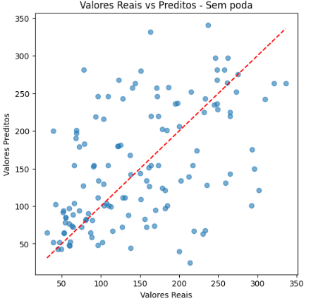
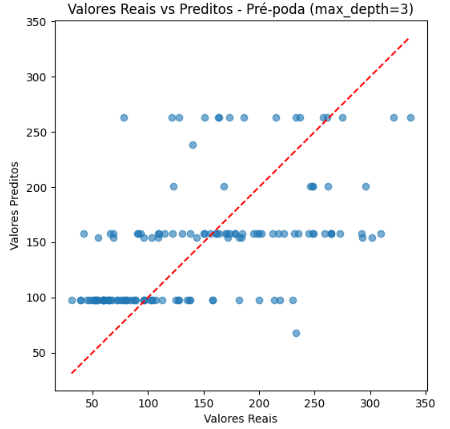
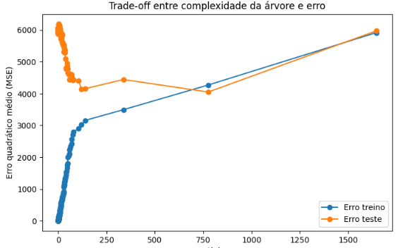
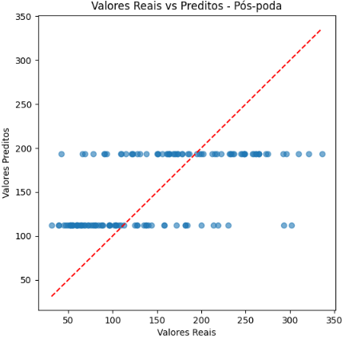

# Portuguese Version

## Explicações gerais

### Sobre o dataset
Esse conjunto de dados é usado para prever a **progressão da diabetes** um ano após a coleta de dados iniciais dos pacientes. É, portanto, um problema de regressão.

#### Estrutura do dataset:
- Contém 442 amostras de pacientes com diabetes.
- Cada amostra possui 10 atributos numéricos: idade, sexo, índice de massa corporal (IMC), pressão arterial média, e seis medições sanguíneas relacionadas, como níveis de colesterol total, lipoproteínas (LDL e HDL), razão colesterol/HDL, triglicerídeos e glicose.

A variável-alvo (target) representa uma medida quantitativa da progressão da doença.

Para maior detalhamento sobre o dataset, acesse:
https://scikit-learn.org/stable/modules/generated/sklearn.datasets.load_diabetes.html

### Sobre como o código foi estruturado
O código foi **pensado para complementar** didaticamente o **tutorial anterior** ([Árvore de classificação para câncer de mama](1.decision_tree_classification.md)). Nele, tínhamos avaliado quatro abordagens:
- Sem poda
- Com pré-poda
- Com pós-poda
- Com pré e pós-poda combinadas

Além disso, apresentamos a visualização das árvores, matrizes de confusão, profundidade, número de nós, e a importância das características.

**Neste tutorial de regressão, poderíamos seguir a estruturas e visualizações análogas. No entanto, para variar a abordagem e enriquecer o aprendizado, optamos por modificar a forma de análise:**

Utilizamos **três estratégias:** 
- **Sem poda**
- **Com pré-poda**
- **Com pós-poda**
  
> Não aplicamos pré e pós-poda combinadas para simplificar nossa análise, haja vista que, em muitos casos, não há ganhos significativos.

Para cada estratégia, temos:
- **MSE e R²**
- **Valores reais vs. valores preditos** para avaliar visualmente a qualidade das previsões.
- **Trade-off entre complexidade da árvore e erro** (MSE), **variando** o parâmetro **ccp_alpha**.

## Código

### Importar bibliotecas

``` python
import pandas as pd
import numpy as np
from sklearn.tree import DecisionTreeRegressor, plot_tree
from sklearn.datasets import load_diabetes
from sklearn.model_selection import train_test_split
from sklearn.metrics import mean_squared_error, r2_score
import matplotlib.pyplot as plt
```
- pandas e numpy: bibliotecas para manipulação de dados.
- DecisionTreeRegressor e plot_tree: para criar e visualizar uma árvore de regressão. 
- load_diabetes: dataset exemplo da biblioteca scikit-learn.
- train_test_split: para dividir os dados em treino e teste.
- mean_squared_error, r2_score: métricas para avaliar o modelo.
- matplotlib.pyplot: para visualizações gráficas.

### Carregar e preparar os dados
 ``` python
data = load_diabetes()
X, y = data.data, data.target
X_train, X_test, y_train, y_test = train_test_split(
    X, y, test_size=0.3, random_state=123
)
 ```
- Carregamos o dataset Diabetes para a variável data.
- X recebe as features (10 atributos numéricos relacionados a exames médicos).
- y recebe a variável alvo contínua (uma medida quantitativa da progressão da doença).
- Dividimos os dados em conjuntos de treino e teste:
  - 70% dos dados vão para treino (X_train, y_train)
  - 30% vão para teste (X_test, y_test)
  - random_state=42 garante que a divisão seja reprodutível (sempre a mesma).

### Sem poda

#### Treinar a árvore
 ``` python
reg_none = DecisionTreeRegressor(random_state=123)
reg_none.fit(X_train, y_train)
 ```

#### Avaliar o modelo
 ``` python
y_pred_none = reg_none.predict(X_test)
mse_none = mean_squared_error(y_test, y_pred_none)
r2_none = r2_score(y_test, y_pred_none)

print(f"MSE (sem poda): {mse_none:.3f}")
print(f"R² (sem poda): {r2_none:.3f}")

plt.figure(figsize=(6,6))
plt.scatter(y_test, y_pred_none, alpha=0.6)
plt.plot([y_test.min(), y_test.max()], [y_test.min(), y_test.max()], 'r--')
plt.xlabel("Valores Reais")
plt.ylabel("Valores Preditos")
plt.title("Valores Reais vs Preditos - Sem poda")
plt.show()
 ```

**Output:**

MSE (sem poda): 6069.880

R² (sem poda): -0.021



> [!NOTE]
> O modelo está mais próximo da idealidade quando mais os pontos azuis se aproximam da reta vermelha (valor real = valor predito). Neste gráfico, percebemos um grande **espalhamento dos pontos**, sugerindo previsões com **alta variabilidade**. Isso indica **possível overfitting**: o modelo se ajusta demais aos dados de treino, mas **perde capacidade de generalização**.

### Com pré-poda

#### Treinar modelo (exemplo com max_depth=3)
 ``` python
reg_pre = DecisionTreeRegressor(max_depth=3, random_state=123)
reg_pre.fit(X_train, y_train)
```

#### Avaliar modelo
 ``` python
y_pred_pre = reg_pre.predict(X_test)
mse_pre = mean_squared_error(y_test, y_pred_pre)
r2_pre = r2_score(y_test, y_pred_pre)

print(f"MSE (pré-poda): {mse_pre:.3f}")
print(f"R² (pré-poda): {r2_pre:.3f}")

plt.figure(figsize=(6,6))
plt.scatter(y_test, y_pred_pre, alpha=0.6)
plt.plot([y_test.min(), y_test.max()], [y_test.min(), y_test.max()], 'r--')
plt.xlabel("Valores Reais")
plt.ylabel("Valores Preditos")
plt.title("Valores Reais vs Preditos - Pré-poda (max_depth=3)")
plt.show()
```
**Output:**
MSE (pré-poda): 4468.328

R² (pré-poda): 0.249



> [!NOTE]
> Com a pré-poda (max_depth=3), a árvore apresenta **predições em poucos níveis fixos**, evidenciando um **modelo muito simplificado**. Os valores preditos se concentram em faixas horizontais, distantes dos valores reais, o que sugere **underfitting**: o modelo **não tem capacidade suficiente para capturar a variabilidade dos dados**.

### Pós-poda

#### Encontrar alpha

 ``` python
path = reg_none.cost_complexity_pruning_path(X_train, y_train)
ccp_alphas, impurities = path.ccp_alphas, path.impurities
```

#### Treinar uma árvore para cada valor de alpha
 ``` python
regs = []
for ccp_alpha in ccp_alphas:
    reg = DecisionTreeRegressor(random_state=123, ccp_alpha=ccp_alpha)
    reg.fit(X_train, y_train)
    regs.append(reg)
 ```

#### Avaliar erro de treino e teste para cada árvore
``` python
train_errors = [mean_squared_error(y_train, reg.predict(X_train)) for reg in regs]
test_errors = [mean_squared_error(y_test, reg.predict(X_test)) for reg in regs]
```

#### Plotar o erro vs alpha para visualizar trade-off
``` python
plt.figure(figsize=(8,5))
plt.plot(ccp_alphas, train_errors, marker='o', label='Erro treino')
plt.plot(ccp_alphas, test_errors, marker='o', label='Erro teste')
plt.xlabel('Alpha')
plt.ylabel('Erro quadrático médio (MSE)')
plt.title('Trade-off entre complexidade da árvore e erro')
plt.legend()
plt.show()
```


> [!NOTE]
> O propósito de gerar este gráfico é visualizar que há um valor de alpha que minimiza o erro no conjunto de teste. A análise valida o processo de pós-poda, mostrando que existe um ponto de complexidade ideal que equilibra o viés e a variância.

#### Selecionar melhor alpha baseado no menor erro no teste
``` python
best_alpha = ccp_alphas[np.argmin(test_errors)]
print(f"Melhor alpha: {best_alpha:.5f}")
```
**Output:**

Melhor alpha: 776.02184

#### Treinar árvore final com melhor alpha
``` python
reg_poda = DecisionTreeRegressor(random_state=123, ccp_alpha=best_alpha)
reg_poda.fit(X_train, y_train)
```

#### Avaliar o modelo podado
``` python
y_pred_poda = reg_poda.predict(X_test)
mse_poda = mean_squared_error(y_test, y_pred_poda)
r2_poda = r2_score(y_test, y_pred_poda)

print(f"MSE (poda pós-treinamento): {mse_poda:.3f}")
print(f"R² (poda pós-treinamento): {r2_poda:.3f}")

Gráfico Valores Reais vs Preditos - podado
plt.figure(figsize=(6,6))
plt.scatter(y_test, y_pred_poda, alpha=0.6)
plt.plot([y_test.min(), y_test.max()], [y_test.min(), y_test.max()], 'r--')
plt.xlabel("Valores Reais")
plt.ylabel("Valores Preditos")
plt.title("Valores Reais vs Preditos - Pós-poda")
plt.show()
```
**Output:**

MSE (poda pós-treinamento): 4049.847

R² (poda pós-treinamento): 0.319



> [!NOTE]
> Com a pós-poda, a simplificação do modelo se torna ainda mais extrema. As predições se consolidam em um número ainda menor de faixas horizontais, caracterizando um caso de underfitting ainda mais severo que o da pré-poda.


### Tabela comparativa
| Estratégia       | MSE     | R²     |
|------------------|---------|--------|
| Sem poda         |  6069.880   |  -0.021  |
| Com pré-poda     |  4468.328   |  0.249  |
| Com pós-poda     |  4049.847   |  0.319  |

