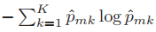
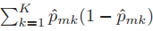

# English Version

## Which is the best split?

We should have the split that:
- For regression, results in less variability among the values in the separated data.
  
- For classification, better separates the classes, making the nodes more “pure”.

More objectively, we minimize some specific functions related to error (for regression) or impurity (for classification). Let’s consider them from now on:

### Classification
We have **two ways** to evaluate whether the split is promoting good performance: **entropy (cross-entropy)** and the **Gini index**.

#### Entropy

Entropy has the following formula, taken from [2]:

Where:

- $\hat{p}_{mk}$: The proportion of samples belonging to class k that are in node m.
- $K$: The total number of distinct classes in the problem.

#### Gini Index

The Gini Index has the following formula, taken from [2]:

Where:
- $\hat{p}_{mk}$: The proportion of samples belonging to class k that are in node m.
- $(1 - \hat{p}_{mk})$: Represents the probability that an item does not belong to class k.
- $K$: The total number of distinct classes in the problem.

### Regression

We should aim for the **smallest RSS (Residual Sum of Squares)** possible. [1]  

Its formula, adapted from [3], is:

$$
RSS = \sum_{i=1}^{n} (y_i - \hat{y}_i)^2
$$

Where:  
- $y_i$ is the actual value of the i-th observation,  
- $\hat{y}_i$ is the predicted value by the model for the i-th observation.

> [!NOTE]
> The residual sum of squares measures the variability that remains unexplained by the model after the regression has been performed. [3]

#### Example

A regression tree predicting a student’s test score based on hours studied. The tree will try to split the data into two groups, aiming for the smallest RSS!

| x = Hours studied   | y = Test score |
|---------------------|----------------|
| 1                   | 2              |
| 2                   | 3              |
| 3                   | 2              |
| 4                   | 8              |

**1) Trying a split: `x ≤ 2.5` and `x > 2.5`**

Group 1 (x ≤ 2.5): A, B  
- Scores: 2, 3  
- Mean:  
  $$\hat{y}_1 = \frac{2 + 3}{2} = 2.5$$
- RSS:  
  $$(2 - 2.5)^2 + (3 - 2.5)^2 = 0.25 + 0.25 = 0.5$$

Group 2 (x > 2.5): C, D  
- Scores: 2, 8  
- Mean:  
  $$\hat{y}_2 = \frac{2 + 8}{2} = 5$$
- RSS:  
  $$(2 - 5)^2 + (8 - 5)^2 = 9 + 9 = 18$$

#### Total RSS for the split:
$$RSS_{total} = 0.5 + 18 = 18.5$$

**2) Trying another split: `x ≤ 3.5` and `x > 3.5`**

Group 1: A, B, C  
- Scores: 2, 3, 2  
- Mean:  
  $$\hat{y}_1 = \frac{2 + 3 + 2}{3} = 2.33$$
- RSS:  
  $$(2 - 2.33)^2 + (3 - 2.33)^2 + (2 - 2.33)^2 \approx 0.11 + 0.44 + 0.11 = 0.66$$

Group 2: D  
- Scores: 8  
- Mean: 8  
- RSS: 0 (no error, since there is only one data point)

#### Total RSS:
$$RSS_{total} \approx 0.66 + 0 = 0.66$$

#### Conclusion

- The best split was at `x ≤ 3.5`, as it had the **smaller total RSS** (≈ 0.66).
- The decision tree **would choose this split** at the first node.

## References
[1] Bishop, C. M. (2006). Pattern recognition and machine learning. Springer.

[2] Hastie, T., Tibshirani, R., & Friedman, J. (2009). The elements of statistical learning: Data mining, inference, and prediction (2nd ed.). Springer.

[3] James, G., Witten, D., Hastie, T., Tibshirani, R., & Taylor, A. (2023). An Introduction to Statistical Learning with Applications in Python. Springer.

# Portuguese Version

## Qual o melhor teste?

Devemos ter o teste que:
- Para regressão, faz ter menor variabilidade entre os valores dos dados separados.
  
- Para classificação, mais separa as classes, fazendo os nós serem mais "puros".

De forma mais objetiva, temos a minimizacão de algumas funcoes específicas relacionadas ao erro (para regressão) ou a impurezas (para classificação). Vamos considerá-las a partir de agora:

### Classificacao
Temos **duas formas** de avaliar se a divisão está promovendo um bom desempenho: **entropia (cross-entropy) e o índice de Gini**. 

#### Entropia

A Entropia tem a seguinte fórmula, retirada de [2]:

Em que:

- $\hat{p}_{mk}$ : É a proporção de amostras pertencentes à classe k que estão no nó m.
- $K$: É o número total de classes distintas no problema.

#### Índice de Gini

O Índice de Gini tem a seguinte fórmula, retirada de [2]:

Em que:
- $\hat{p}_{mk}$ : É a proporção de amostras pertencentes à classe k que estão no nó m.
- $(1 - \hat{p}_{mk})$: Representa a probabilidade de um item não pertencer à classe k.
- $K$: É o número total de classes distintas no problema.

### Regressão

Devemos ter o **menor RSS (Soma dos Quadrados dos Resíduos)** possível.[1] 

Sua fórmula, adaptada de [3], é:

$$
RSS = \sum_{i=1}^{n} (y_i - \hat{y}_i)^2
$$

Em que:  
- $y_i$ é o valor real da i-ésima observação,  
- $\hat{y}_i$ é o valor previsto pelo modelo para a i-ésima observação.

  > [!NOTE]
  > A soma dos quadrados dos resíduos mede a variabilidade que permanece não explicada pelo modelo após a regressão ter sido efetuada. [3]

#### Exemplo

Árvore de regressão que prevê a nota de um estudante em uma prova com base em horas estudadas. A árvore tentará dividir os dados em dois grupos, objetivando o menor RSS!

| x = Horas estudadas | y = Nota na prova |
|---------------------|-------------------|
| 1                   | 2                 |
| 2                   | 3                 |
| 3                   | 2                 |
| 4                   | 8                 |

**1) Tentando uma divisão: `x ≤ 2.5` e `x > 2.5`**

Grupo 1 (x ≤ 2.5): A, B  
- Notas: 2, 3  
- Média: 
  $$\hat{y}_1 = \frac{2 + 3}{2} = 2.5$$
- RSS: 
  $$(2 - 2.5)^2 + (3 - 2.5)^2 = 0.25 + 0.25 = 0.5$$

Grupo 2 (x > 2.5): C, D 
- Notas: 2, 8  
- Média: 
  $$\hat{y}_2 = \frac{2 + 8}{2} = 5$$
- RSS:
  $$(2 - 5)^2 + (8 - 5)^2 = 9 + 9 = 18$$

#### RSS total da divisão:
$$RSS_{total} = 0.5 + 18 = 18.5$$

**2) Tentando outra divisão: `x ≤ 3.5` e `x > 3.5`**

Grupo 1: A, B, C  
- Notas: 2, 3, 2  
- Média: 
  $$\hat{y}_1 = \frac{2 + 3 + 2}{3} = 2.33$$
- RSS:
  $$(2 - 2.33)^2 + (3 - 2.33)^2 + (2 - 2.33)^2 \approx 0.11 + 0.44 + 0.11 = 0.66$$

Grupo 2: D  
- Notas: 8  
- Média: 8  
- RSS: 0 (sem erro, pois há só um dado)

#### RSS total:
$$RSS_{total} \approx 0.66 + 0 = 0.66$$

#### Conclusão

- A melhor divisão foi em `x ≤ 3.5`, pois teve **RSS total menor** (≈ 0.66).
- A árvore de decisão **escolheria essa divisão** no primeiro nó.

## Referências
[1] Bishop, C. M. (2006). Pattern recognition and machine learning. Springer.

[2] Hastie, T., Tibshirani, R., & Friedman, J. (2009). The elements of statistical learning: Data mining, inference, and prediction (2nd ed.). Springer.

[3] James, G., Witten, D., Hastie, T., Tibshirani, R., & Taylor, A. (2023). An Introduction to Statistical Learning with Applications in Python. Springer.
