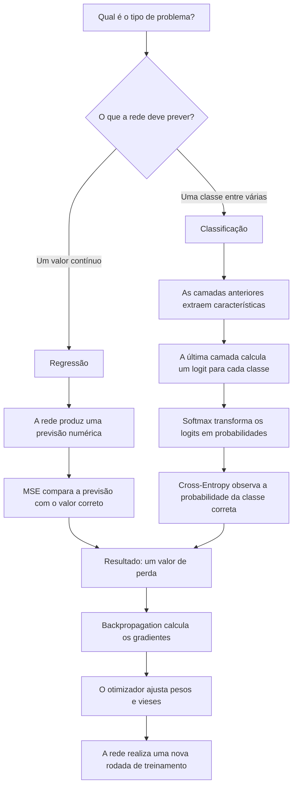

# Funções de Perda em Redes Neurais Densas

## Introdução

Durante o treinamento, uma rede neural recebe dados de entrada e produz uma previsão. Porém, apenas produzir uma resposta não é suficiente: o modelo precisa de uma maneira objetiva de comparar sua previsão com o valor correto. Essa comparação é realizada por uma **função de perda** (*loss function*), que transforma o erro da previsão em um valor numérico a ser minimizado [1] [2].

Neste material, o conteúdo seguirá o caminho mostrado no fluxograma: primeiro será identificado o tipo de problema; depois será apresentada a saída produzida pela rede; por fim, será escolhida a função de perda adequada.

No caminho da classificação, cada elemento possui uma função diferente:

- a **rede neural** aprende representações a partir da entrada;
- a **última camada** calcula os logits;
- a **Softmax** converte esses valores brutos em uma distribuição de probabilidades; no PyTorch, essa etapa faz parte do cálculo interno de `CrossEntropyLoss`;
- a **Cross-Entropy** verifica quanto de probabilidade foi atribuído à classe correta;
- o resultado é a **perda**, utilizada no cálculo dos gradientes.

> [!IMPORTANT]
> O fluxograma apresenta a sequência matemática encontrada nos livros: logits, Softmax, probabilidades e Cross-Entropy. No PyTorch, a Softmax não desaparece; sua operação é incorporada ao cálculo de `CrossEntropyLoss`, que combina `LogSoftmax` e `NLLLoss`. Por isso, durante o treinamento, os logits são enviados diretamente à função de perda e não se adiciona uma Softmax separada [2] [3].

De maneira simplificada, a rede primeiro produz uma previsão durante o *forward pass*. A função de perda compara essa previsão com o alvo correto. Em seguida, a retropropagação calcula os gradientes da perda em relação aos parâmetros, e o otimizador utiliza esses gradientes para atualizar os pesos e vieses da rede [2].

> [!IMPORTANT]
> A função de perda define matematicamente o que significa “errar”. O *backpropagation* calcula como cada parâmetro contribuiu para esse erro, enquanto o otimizador determina como os parâmetros serão atualizados. São etapas relacionadas, mas não são a mesma coisa.

O funcionamento da propagação dos gradientes já foi desenvolvido no material [Grafos Computacionais e Backpropagation](../../dl_fundamentos_redes_neurais/content/03_grafos_computacionais_e_backpropagation.md). Os métodos que utilizam esses gradientes — SGD, Momentum, RMSProp e Adam — são apresentados em [Algoritmos de Otimização em Redes Neurais Densas](01_algoritmos_de_otimização.md). O presente texto conecta os dois conteúdos ao explicar de onde vem o valor de perda que é propagado para trás e depois reduzido pelos otimizadores.

## Perda, custo, objetivo e métrica

Os termos *loss*, *cost* e *objective* podem ser usados de maneiras ligeiramente diferentes entre livros e bibliotecas. Neste material, será adotada a seguinte organização didática:

- **perda (*loss*):** erro calculado para uma amostra ou um mini-batch;
- **custo (*cost*):** agregação das perdas de várias amostras;
- **função objetivo:** expressão completa que será minimizada, podendo incluir a perda e termos de regularização;
- **métrica:** medida usada para interpretar o desempenho, como acurácia, F1 ou erro absoluto médio.

> [!NOTE]
> Na prática, é comum encontrar “função de perda”, “função de custo” e “função objetivo” sendo usadas como sinônimos. O mais importante é observar o que a expressão realmente calcula.

## MSE para problemas de regressão

### O que é regressão?

Regressão é uma tarefa em que o modelo deve prever um valor contínuo. Alguns exemplos são:

- temperatura;
- preço de um imóvel;
- consumo de energia;
- concentração de uma substância;
- tempo necessário para concluir uma atividade.

Uma das funções de perda utilizadas nesses problemas é o **Erro Quadrático Médio**, conhecido como MSE (*Mean Squared Error*). O MSE calcula a média do quadrado da diferença entre o valor correto e a previsão [1].

$$
\mathrm{MSE}=\frac{1}{N}\sum_{i=1}^{N}(y_i-\hat{y}_i)^2
$$

Nessa expressão:

- $N$ é a quantidade de elementos considerados;
- $y_i$ é o valor correto do elemento $i$;
- $\hat{y}_i$ é o valor previsto pelo modelo;
- $(y_i-\hat{y}_i)$ é o erro da previsão;
- o quadrado impede que erros positivos e negativos se cancelem.

### Exemplo numérico

Considere três valores corretos e três previsões:

| Amostra | Valor correto $y$ | Previsão $\hat{y}$ | Erro | Erro ao quadrado |
|---|---:|---:|---:|---:|
| 1 | 3 | 2 | 1 | 1 |
| 2 | 5 | 5 | 0 | 0 |
| 3 | 7 | 9 | -2 | 4 |

O MSE será:

$$
\mathrm{MSE}=\frac{1+0+4}{3}=\frac{5}{3}\approx1{,}67
$$

O valor do MSE não representa “quantos exemplos estão errados”. Ele representa a média dos erros quadráticos. Seu valor deve ser interpretado considerando a escala da variável prevista e comparado entre experimentos realizados nas mesmas condições.

### Relação com os gradientes

Para uma única previsão, considerando $L=(\hat{y}-y)^2$, a derivada em relação à previsão é:

$$
\frac{\partial L}{\partial \hat{y}}=2(\hat{y}-y)
$$

Isso significa que a magnitude da contribuição para o gradiente cresce com a magnitude do erro. Como o erro também é elevado ao quadrado no cálculo da perda, valores muito distantes do alvo exercem influência proporcionalmente maior, como mostra o exemplo a seguir.

> [!NOTE]
> No MSE, um erro de magnitude 2 contribui com $2^2=4$, enquanto um erro de magnitude 10 contribui com $10^2=100$. Assim, poucos valores extremos podem influenciar fortemente o treinamento.

## Cross-Entropy para classificação

### O que é classificação?

Classificação é uma tarefa em que a saída pertence a uma categoria. Alguns exemplos são:

- identificar se uma mensagem é *spam* ou não;
- reconhecer um dígito de 0 a 9;
- classificar uma peça como normal ou defeituosa;
- identificar a categoria de uma imagem.

Para compreender a Cross-Entropy, primeiro é necessário entender os conceitos de entropia, logits e Softmax.

> [!NOTE]
> **O que significa entropia?**
>
> Na Teoria da Informação, a entropia quantifica a incerteza de uma distribuição. Distribuições próximas de um resultado determinístico possuem entropia menor, enquanto distribuições próximas da uniforme possuem entropia maior. A entropia cruzada entre uma distribuição correta $P$ e uma distribuição prevista $Q$ é definida por $H(P,Q)=-\mathbb{E}_{x\sim P}\log Q(x)$. Mantendo $P$ fixa, minimizar a entropia cruzada em relação a $Q$ equivale a minimizar a divergência de Kullback-Leibler [1].

### Logits e Softmax

Em uma classificação com $C$ classes, a última camada da rede pode produzir um valor para cada classe. Esses valores brutos são chamados de **logits**. Eles podem ser positivos ou negativos e não precisam somar 1 [3].

### De onde vêm os logits?

Os logits não são valores escolhidos manualmente ou sorteados a cada previsão. Eles são calculados pela camada de saída da rede a partir das informações produzidas pela camada anterior. Em uma camada densa, esse cálculo é uma soma ponderada [4]:

$$
\mathbf{z}=W\mathbf{h}+\mathbf{b}
$$

Nessa expressão:

- $\mathbf{h}$ contém as informações que chegaram da camada anterior;
- $W$ contém os pesos que a rede aprende durante o treinamento;
- $\mathbf{b}$ contém os vieses aprendidos;
- $\mathbf{z}$ é o vetor de logits, com um valor para cada classe.

Considere uma rede com três classes: gato, cachorro e pássaro. Suponha que, após processar uma imagem, a camada anterior tenha produzido duas informações:

$$
\mathbf{h}=[1;\ 2]
$$

Para fins didáticos, considere os seguintes pesos e vieses na camada de saída:

| Classe | Primeiro peso | Segundo peso | Viés |
|---|---:|---:|---:|
| gato | 1 | 0,5 | 0 |
| cachorro | 1 | 0 | 0 |
| pássaro | -1 | 0,5 | 0 |

Cada classe possui seu próprio conjunto de pesos. O logit de cada uma é calculado separadamente:

$$
z_{gato}=1\cdot1+0{,}5\cdot2+0=2
$$

$$
z_{cachorro}=1\cdot1+0\cdot2+0=1
$$

$$
z_{pássaro}=-1\cdot1+0{,}5\cdot2+0=0
$$

Assim, a camada de saída produz:

$$
\mathbf{z}=[2;\ 1;\ 0]
$$

O logit 2 para “gato” significa apenas que, para essa entrada e com os pesos atuais, a rede atribuiu a essa classe um valor maior que às demais. Ele ainda não significa 2%, 20% ou qualquer outra probabilidade.

> [!IMPORTANT]
> Os pesos e vieses usados nesse cálculo são ajustados durante o treinamento. A função de perda fornece o erro, e o otimizador utiliza os gradientes desse erro para atualizar esses parâmetros [2]. Os números da tabela acima são apenas um exemplo didático de uma camada de saída.

A função Softmax transforma os logits em valores entre 0 e 1 cuja soma é igual a 1 [4]:

$$
p_k=\frac{e^{z_k}}{\sum_{j=1}^{C}e^{z_j}}
$$

Nessa expressão:

- $z_k$ é o logit da classe $k$;
- $C$ é a quantidade de classes;
- $p_k$ é o valor normalizado associado à classe $k$.

> [!NOTE]
> Um logit não é uma probabilidade. Ele é um valor bruto produzido pela rede. A Softmax transforma o conjunto de logits em uma distribuição normalizada.

### Exemplo passo a passo: de logits para probabilidades

Considere uma rede que precisa classificar uma imagem em uma destas três categorias:

| Posição da saída | Classe |
|---:|---|
| 1 | gato |
| 2 | cachorro |
| 3 | pássaro |

Para uma determinada imagem, a rede produziu os seguintes logits:

| Classe | Logit |
|---|---:|
| gato | 2,0 |
| cachorro | 1,0 |
| pássaro | 0,0 |

O maior valor é o da classe “gato”, mas os números 2, 1 e 0 ainda não são probabilidades. Eles somam 3, e uma probabilidade não pode ser interpretada apenas comparando essa soma. A Softmax primeiro calcula a exponencial de cada logit:

| Classe | Cálculo | Resultado aproximado |
|---|---:|---:|
| gato | $e^2$ | 7,39 |
| cachorro | $e^1$ | 2,72 |
| pássaro | $e^0$ | 1,00 |

A soma desses resultados é aproximadamente $11{,}11$. Em seguida, cada valor é dividido por essa soma:

| Classe | Cálculo | Probabilidade aproximada |
|---|---:|---:|
| gato | $7{,}39/11{,}11$ | 0,665 ou 66,5% |
| cachorro | $2{,}72/11{,}11$ | 0,245 ou 24,5% |
| pássaro | $1/11{,}11$ | 0,090 ou 9,0% |

Agora os valores estão entre 0 e 1 e somam 1. A rede escolheria “gato”, pois essa classe possui a maior probabilidade. A Softmax não descobre qual classe está correta; ela apenas transforma os valores brutos da rede em uma distribuição normalizada [4].

> [!TIP]
> **Logit responde:** “qual é o valor bruto atribuído a cada classe?”  
> **Softmax responde:** “como esses valores ficam distribuídos entre as classes?”  
> **Cross-Entropy responde:** “quanto essa distribuição se distancia da resposta correta?”

### Fórmula da Cross-Entropy

Para uma distribuição correta $y$ e uma distribuição prevista $p$, a entropia cruzada pode ser escrita como [1] [4]:

$$
L=-\sum_{k=1}^{C}y_k\log(p_k)
$$

Em uma classificação de rótulo único, a distribuição correta costuma ser representada como *one-hot*: a classe correta recebe 1 e as demais recebem 0. Nesse caso, somente o termo da classe correta permanece na soma:

$$
L=-\log(p_{\text{classe correta}})
$$

Continuando o exemplo anterior, suponha que a imagem realmente mostre um gato. A resposta correta pode ser representada em formato *one-hot*:

| Classe | Resposta correta $y$ | Probabilidade prevista $p$ |
|---|---:|---:|
| gato | 1 | 0,665 |
| cachorro | 0 | 0,245 |
| pássaro | 0 | 0,090 |

Substituindo esses valores na fórmula:

$$
L=-[1\cdot\ln(0{,}665)+0\cdot\ln(0{,}245)+0\cdot\ln(0{,}090)]
$$

Os termos multiplicados por zero desaparecem. Portanto:

$$
L=-\ln(0{,}665)\approx0{,}408
$$

Isso mostra por que, quando existe uma única classe correta, a Cross-Entropy precisa observar apenas a probabilidade que o modelo atribuiu a essa classe. As probabilidades das outras classes continuam importantes indiretamente, pois todas competem entre si e devem somar 1.

Assim, aumentar a probabilidade atribuída à classe correta reduz a perda. Uma previsão errada feita com muita confiança recebe uma penalidade maior [4].

> [!NOTE]
> **Por que aparecem o logaritmo e o sinal negativo?**
>
> A verossimilhança representa a probabilidade que o modelo atribui aos dados observados. O logaritmo transforma produtos de probabilidades em somas sem alterar o ponto de máximo da verossimilhança. Como probabilidades entre 0 e 1 possuem logaritmo menor ou igual a zero, utiliza-se o sinal negativo para expressar o treinamento como minimização: probabilidade 1 para a classe correta produz perda 0, enquanto probabilidades próximas de 0 produzem perdas cada vez maiores [1] [4]. Neste contexto, `log` representa o logaritmo natural.

### Comparando previsões diferentes

Suponha novamente que a classe correta seja “gato”. A tabela mostra como a perda muda de acordo com a confiança da rede:

| Situação | Gato | Cachorro | Pássaro | Classe escolhida | Perda $-\ln(p_{gato})$ |
|---|---:|---:|---:|---|---:|
| correta e confiante | 90% | 7% | 3% | gato | 0,105 |
| correta, mas insegura | 45% | 40% | 15% | gato | 0,799 |
| errada e insegura | 35% | 40% | 25% | cachorro | 1,050 |
| errada e confiante | 5% | 90% | 5% | cachorro | 2,996 |

Na primeira linha, a rede acerta e atribui 90% à classe correta, por isso a perda é pequena. Na segunda, ela também escolhe “gato”, mas quase escolhe “cachorro”; a acurácia consideraria as duas primeiras previsões igualmente corretas, enquanto a Cross-Entropy atribui uma perda maior à previsão insegura.

Nas duas últimas linhas, a rede erra. O erro mais confiante recebe a maior penalidade, pois apenas 5% da probabilidade foi reservada para a classe correta.

> [!IMPORTANT]
> A Cross-Entropy não verifica apenas se a classe final está correta. Ela também considera a confiança atribuída à classe correta. Duas previsões que resultam na mesma classe podem ter perdas diferentes.

## MSE ou Cross-Entropy?

A função de perda deve ser escolhida de acordo com o significado da saída e do alvo.

| Tipo de problema | Saída da rede | Perda adequada | Alvo esperado |
|---|---|---|---|
| Regressão | valor contínuo | MSE | valor contínuo |
| Classificação multiclasse | um valor por classe | Cross-Entropy | índice da classe correta |

Embora seja matematicamente possível construir classificadores treinados com erro quadrático, a Cross-Entropy possui uma interpretação probabilística diretamente ligada à distribuição das classes e à maximização da verossimilhança [1] [4]. Por isso, ela é uma escolha apropriada para o exemplo introdutório de classificação multiclasse discutido neste material.

> [!TIP]
> Uma regra inicial útil é: **MSE para prever valores; Cross-Entropy para escolher classes**. Essa regra não cobre todos os problemas existentes, mas orienta corretamente os casos introdutórios deste material.

## Relação entre a perda e a otimização

A retropropagação calcula os gradientes da função de perda em relação aos parâmetros da rede. Em seguida, o otimizador utiliza esses gradientes para atualizar os parâmetros [2]. Como os gradientes são derivados da função de perda escolhida, perdas diferentes podem fornecer sinais de atualização diferentes.

## Perda de treinamento e perda de validação

Observar somente a perda de treinamento não informa como a rede se comporta em exemplos não utilizados para ajustar seus parâmetros. Por isso, é necessário acompanhar o desempenho em um conjunto separado de validação [1] [2].

| Comportamento | Possível interpretação |
|---|---|
| perdas de treino e validação diminuem | há melhora nos dois conjuntos observados |
| perda de treino diminui e validação aumenta | possível *overfitting* |
| as duas perdas permanecem altas | o treinamento precisa ser investigado; esse comportamento isolado não identifica a causa |
| perda oscila ou cresce rapidamente | há possível instabilidade, que deve ser investigada junto dos hiperparâmetros e dos dados |

Esses padrões são indícios, não diagnósticos isolados. Eles devem ser analisados junto das métricas da tarefa e das condições do experimento.

## Conclusão

A função de perda transforma a diferença entre a previsão e o alvo em um valor matemático que pode ser minimizado durante o treinamento. O MSE mede erros quadráticos e é adequado para problemas de regressão, nos quais a rede prevê valores contínuos. A Cross-Entropy, por sua vez, avalia a distribuição de probabilidades produzida em relação à classe correta e é adequada para problemas de classificação.

Escolher a função de perda exige observar o tipo de tarefa, o significado da saída da rede e a forma como o alvo é representado. Em redes densas, o valor da perda serve como ponto de partida para o *backpropagation*, que calcula os gradientes. O otimizador utiliza esses gradientes para ajustar os pesos e reduzir os erros nas próximas previsões.

## Referências

[1] GOODFELLOW, Ian; BENGIO, Yoshua; COURVILLE, Aaron. *Deep Learning*. Cambridge: MIT Press, 2016. Disponível em: <https://www.deeplearningbook.org/>. Acesso em: 1 out. 2026.

[2] PYTORCH. *Optimizing Model Parameters*. PyTorch Tutorials. Disponível em: <https://docs.pytorch.org/tutorials/beginner/basics/optimization_tutorial.html>. Acesso em: 1 out. 2026.

[3] PYTORCH. *CrossEntropyLoss*. PyTorch Documentation. Disponível em: <https://docs.pytorch.org/docs/stable/generated/torch.nn.CrossEntropyLoss.html>. Acesso em: 1 out. 2026.

[4] STANFORD UNIVERSITY. *CS231n: Linear Classification — Softmax Classifier*. Stanford Vision and Learning Lab. Disponível em: <https://cs231n.github.io/linear-classify/>. Acesso em: 1 out. 2026.
