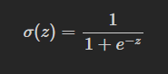
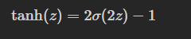
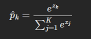
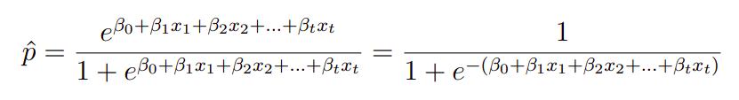

# Neurônio Linear

## Introdução Sobre Neurônio Linear

### O que é um Neurônio Linear?

No machine learning, o neurônio linear é a forma mais simples de um neurônio artificial, uma estrutura inspirada no cérebro humano. Ele funciona como a unidade básica de uma rede neural: recebe valores de entrada, realiza operações matemáticas sobre esses dados e produz uma saída, que pode ser enviada para outros neurônios da rede.

## Funções de agregação

### O que são funções de agregação?

As funções de agregação representam a primeira etapa do processamento em um neurônio artificial. Sua principal função é reunir as informações recebidas pelas entradas do neurônio, combinando esses valores por meio de operações matemáticas, geralmente a soma ponderada entre entradas e pesos. O resultado dessa agregação gera um valor numérico que será utilizado na próxima etapa da rede neural.

### Como funcionam?

**Estrutura:**

- O neurônio recebe um conjunto de entradas ($x_1$, $x_2$, $x_3$, …);
- Cada entrada é associada a um peso ($w_1$, $w_2$, $w_3$, …), que indica sua importância;
- Os valores são combinados por meio de uma soma;
- Ao resultado, adiciona-se um viés (*bias* $b$) para ajustar a saída produzida.

**Fórmula:**

$$
z = w_1x_1 + w_2x_2 + w_3x_3 + \cdots + w_nx_n + b
$$

**Elementos principais:**

- Entradas ($x$): dados recebidos pelo neurônio;
- Pesos ($w$): controlam a influência de cada entrada no cálculo;
- Viés ($b$): valor adicional utilizado para ajustar o comportamento do modelo;
- Resultado da agregação ($z$): valor obtido antes da função de ativação.

A operação também pode ser expressa de forma algébrica pela seguinte notação:

$$
z = \mathbf{w}^{T}\mathbf{x}+b
$$

Do ponto de vista geométrico, o resultado da soma ponderada ($z$) indica a posição dos dados de entrada em relação à fronteira de decisão do modelo. Entretanto, esse valor ainda não corresponde à saída final do neurônio. Após a etapa de agregação, o valor $z$ é enviado para uma função de ativação, responsável por aplicar uma transformação não linear ao sinal e gerar a ativação final do neurônio.

## Funções de ativação

### O que é e como funcionam

Uma função de ativação é aplicada a soma ponderada das entradas de um neurônio. O modelo calcula o produto matricial dos inputs pelos pesos e soma o viés:

$$
z = \mathbf{x}^{T}\mathbf{w}+b
$$

Por fim, a função pega esse valor $z$ e transforma em um sinal de saída. Isso molda a saída para algo interpretável ou para mudar o comportamento do gradiente no treino.

### As principais funções de ativação

#### Sigmoide

Comprime qualquer valor real para o intervalo entre 0 e 1. É a função padrão para a camada de saída de classificadores binários, entregando o resultado em formato de probabilidade.

#### ReLU

Se o valor for negativo retorna 0, caso contrário, retorna o próprio valor.

$$
\operatorname{ReLU}(z)=\max(0,z)
$$

#### Tanh

Varia entre -1 e 1 e é centralizada em 0. Tende a deixar a camada mais equilibrada no início do treinamento.

#### Softmax

Olha para o conjunto de saídas de uma camada inteira com $K$ classes.

Ela transforma o vetor de scores brutos em uma distribuição de probabilidade. Todas as saídas individuais resultam em valores entre 0 e 1, e a soma de todas as saídas dá exatamente 1. É usada principalmente na camada de saída de modelos de classificação multiclasse.

## Funções de ativação na quebra de linearidade

Uma combinação de funções lineares resulta sempre em outra função linear. Logo, se não for usada uma função de ativação não-linear entre as camadas, um modelo com centenas de camadas ocultas seria matematicamente idêntico a uma regressão linear simples. Dessa forma, é a não linearidade que deforma o espaço de decisão, permitindo que o modelo aprenda padrões complexos e resolva problemas que não são linearmente separáveis.

## Como pode ser aplicado

A regressão logística é um algoritmo de aprendizado supervisionado utilizado para problemas de classificação binária, ou seja, situações em que existem apenas duas classes possíveis, como “sim” ou “não”, “aprovado” ou “reprovado”. O modelo estima a probabilidade de uma determinada entrada pertencer a uma das classes, produzindo valores entre 0 e 1.

O modelo de regressão logística pode ser interpretado como um neurônio artificial simples, no qual as entradas são combinadas por meio de uma função de agregação linear. O resultado dessa combinação é então submetido à função de ativação sigmoid, responsável por transformar a saída em uma probabilidade entre 0 e 1.

## Código

O código produzido sobre neurônio linear está no notebook [Neurônio e funções de ativação](../code/neuronio_e_funcoes_de_ativacao.ipynb).

## Referências

- WIKIPEDIA CONTRIBUTORS. Neural network (machine learning). Disponível em: <https://en.wikipedia.org/w/index.php?title=Neural_network_(machine_learning)&oldid=1354863294>.
- GARCÍA CABELLO, Julia. Mathematical neural networks. Axioms, v. 11, n. 2, p. 80, 2022.
- LUÍS, São. Regressão Logística e suas Aplicações. Disponível em: <https://monografias.ufma.br/jspui/bitstream/123456789/3572/1/LEANDRO-GONZALEZ.pdf>. Acesso em: 18 maio 2026.
- WIKIPEDIA CONTRIBUTORS. Regressão logística. Disponível em: <https://pt.wikipedia.org/w/index.php?title=Regress%C3%A3o_log%C3%ADstica&oldid=70810424>. Acesso em: 18 maio 2026.
- GÉRON, Aurélien. Hands-On Machine Learning with Scikit-Learn, Keras, and TensorFlow: Concepts, Tools, and Techniques to Build Intelligent Systems. 3. ed. Sebastopol: O'Reilly Media, 2022.
- GOODFELLOW, Ian; BENGIO, Yoshua; COURVILLE, Aaron. Deep Learning. Cambridge: MIT Press, 2016. Disponível em: <https://www.deeplearningbook.org/>.
- STANFORD UNIVERSITY. CS231n: Convolutional Neural Networks for Visual Recognition - Neural Networks Part 1: Setting up the Architecture. Stanford: Stanford Vision Lab, [s.d.]. Disponível em: <https://cs231n.github.io/neural-networks-1/>.

## Colaboradores

| | | |
|:---:|:---:|:---:|
| [ Beatriz Schuelter Tartare](https://github.com/beastartare) | [ Clara Marcela Grossl](https://github.com/Clara-M-Grossl) | [ Vinícius Muchulski](https://github.com/vini-muchulski) |
