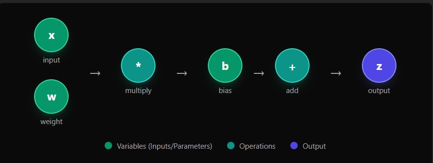
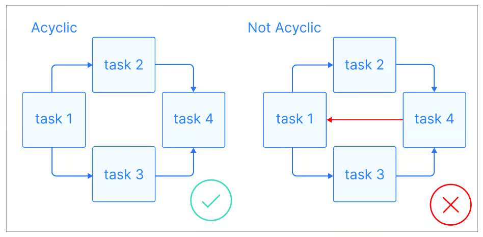
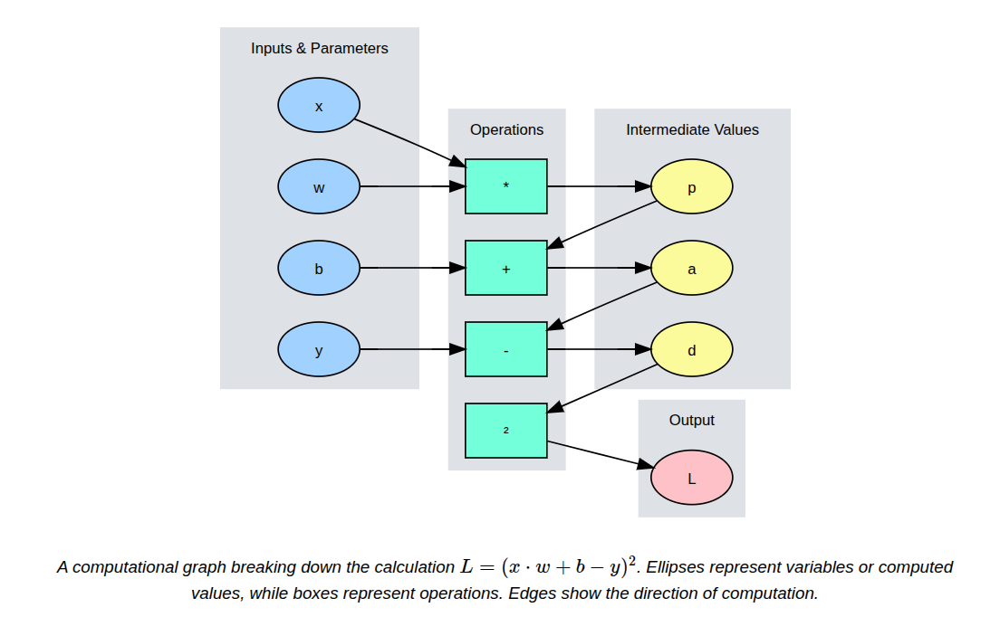

# Grafos Computacionais

## O que é grafo computacional?

### 1.1 Definição e Anatomia do Grafo

Um grafo computacional é uma representação visual e funcional de uma expressão matemática estruturada como um grafo direcionado. Ele decompõe fórmulas complexas em um conjunto de nós e arestas:

- **Nós:** Representam desde os dados brutos de entrada ($x$) e parâmetros treináveis ($w$, $b$) até operações matemáticas (adição, multiplicação) e funções de ativação.
- **Arestas:** Demonstram o fluxo de dados e as dependências funcionais. O sentido da seta estabelece qual nó depende do resultado de outro.

Exemplo:

$$
z=(xw)+b
$$

Os nós verdes representam variáveis: entradas ($x$), parâmetros ($w$, $b$).

Os nós azulados representam as operações: multiplicação, adição.

O nó roxo representa a saída.

As arestas mostram o fluxo de dados da esquerda para a direita.

Nessa estrutura, a hierarquia das operações é respeitada: um nó só pode ser processado quando todos os dados das suas arestas estão disponíveis. Isso transforma a fórmula matemática em uma sequência lógica de passos.

### 1.2 Grafo Acíclico Direcionado (DAG)

O Grafo Acíclico Direcionado (DAG) é uma ferramenta poderosa para gerenciar esses fluxos para evitar erros. Seguindo as definições básicas, um DAG é um grafo sem ciclos direcionados, em que cada nó representa uma tarefa específica e cada aresta indica a dependência entre elas.

Quando iniciado em um nó, só é possível avançar, nunca retornando a um nó anterior durante o Forward Pass fluindo da entrada para a saída. Assim, as tarefas são executadas em ordem, sem gerar loops. Ademais, apresentam uma estrutura hierárquica, em que as tarefas são organizadas em camadas. Com isso, as tarefas superiores dependem da finalização de tarefas em níveis inferiores.

### 1.3 Importância do DAG

**Cálculo de Gradientes:** A mesma estrutura que organiza a predição pode ser percorrida em sentido inverso (Backward Pass). Ao aplicar a Regra da Cadeia em cada nó, o framework consegue calcular o impacto de cada parâmetro no erro final.

**Eficiência de Memória:** O grafo armazena valores intermediários durante o Forward Pass, que são reutilizados pelo Backward Pass, evitando cálculos redundantes e economizando ciclos de processamento.

**Paralelismo:** Ao definir as dependências antecipadamente, o sistema pode identificar quais operações são independentes e executá-las simultaneamente em diferentes núcleos da CPU ou GPU.

### 1.4 Grafos estáticos versus dinâmicos

Em frameworks com grafos computacionais estáticos, ocorre a construção da organização para só depois “injetar” os dados reais. Ele é compilado e otimizado, logo melhorando o desempenho, contudo os grafos estáticos possuem uma flexibilidade menor ao modificar a arquitetura do modelo, já que qualquer alteração exige uma redefinição e recompilação de todo o grafo.

Dentro dos grafos computacionais dinâmicos, o grafo é construído em tempo real à medida que ocorrem as operações, sendo assim, ela é definida durante a execução, possibilitando o feedback imediato e alterações no modelo. Assim, os principais benefícios são: a flexibilidade e a facilidade de depuração, uma vez que é possível modificá-lo passo a passo.

### Referências de grafos computacionais

- GEEKSFORGEEKS. Computational Graph in PyTorch. Disponível em: <https://www.geeksforgeeks.org/computational-graph-in-pytorch>. Acesso em: 14 maio 2026.
- DATACAMP. What is a DAG? A Practical Guide with Examples. Disponível em: <https://www.datacamp.com/blog/what-is-a-dag>. Acesso em: 03 maio 2026.
- JAIN, Abhishek. Static vs Dynamic Computational Graphs. Medium, 2024. Disponível em: <https://medium.com/@abhishekjainindore24/static-vs-dynamic-computational-graphs-5a49d1e3030b>. Acesso em: 14 maio 2026.
- TENSORTONIC. Computational Graphs & Backpropagation Explained. Disponível em: <https://www.tensortonic.com/ml-math/graph-theory/computational-graphs>. Acesso em: 02 maio 2026.

## Forward Pass e Backward Pass

O Forward Pass (propagação para frente) e o Backward Pass (retropropagação ou back-propagation) são os dois processos fundamentais que compõem o ciclo de treinamento e execução de uma rede neural profunda.

### Forward Pass (Propagação para Frente)

O Forward Pass resolve a expressão percorrendo o grafo das entradas até a saída. Durante esse fluxo, os valores intermediários são armazenados em cada nó. Essa etapa é crucial, pois esses dados são requisitos para o cálculo dos gradientes no Backward Pass. O processo se encerra com a geração de uma predição $\hat{y}$, que é então confrontada com o valor real $y$ por meio de uma função de perda $L(y,\hat{y})$.

Imagine a função de perda de erro quadrático, que será nossa função de custo, para um modelo linear simples $z=xw+b$:

$$
L=(xw+b-y)^2
$$

Para o computador processar essa expressão, o grafo a decompõe em unidades fundamentais (nós):

$$
\begin{aligned}
p &= x\cdot w && \text{(Multiplication)} \\
a &= p+b && \text{(Addition)} \\
d &= a-y && \text{(Subtraction)} \\
L &= d^2 && \text{(Squaring)}
\end{aligned}
$$

Se utilizarmos as entradas $x=2$, $y=5$ e os parâmetros $w=3$, $b=1$, o fluxo de dados seria:

$$
\begin{aligned}
p &= x\cdot w=2\cdot3=6 \\
a &= p+b=6+1=7 \\
d &= a-y=7-5=2 \\
L &= d^2=2^2=4
\end{aligned}
$$

Neste ponto, o grafo não apenas sabe que o custo atual é 4, mas mantém em memória que $d=2$, $a=7$ e $p=6$. Sem esses valores, seria impossível calcular o quanto o ajuste em $w$ afetaria o resultado final lá no passo de volta (Backward Pass).

### Backward Pass (Retropropagação / Back-propagation)

Após o cálculo do custo no final do Forward Pass, a informação flui no sentido contrário (da saída para a entrada) para calcular o gradiente da função de custo em relação aos parâmetros da rede. Este processo inicia-se no nó de saída $L$ e percorre o grafo de trás para frente, utilizando a regra da cadeia do cálculo de forma local, recursiva e eficiente. Em cada nó, o algoritmo determina como cada peso $w$ e viés $b$ contribuiu especificamente para o erro final. O objetivo principal deste passo é fornecer os gradientes necessários para que um algoritmo de otimização possa atualizar os pesos e reduzir o erro no próximo ciclo.

O mecanismo de cálculo por trás desse processo baseia-se em três pilares fundamentais que garantem a eficiência do aprendizado. Tudo se inicia no nó de saída final, onde estabelecemos que o gradiente da perda em relação a si mesma é sempre igual a um. Este valor unitário funciona como o sinal inicial que alimenta toda a retropropagação.

A partir daí, o algoritmo utiliza a Regra da Cadeia de forma localizada: para qualquer nó que processe uma entrada $u$ e gere uma saída $z$, o gradiente que retorna da frente é multiplicado pelo gradiente local daquela operação específica, resultando no gradiente da perda em relação à entrada:

$$
\frac{\partial L}{\partial u}
=
\frac{\partial L}{\partial z}
\frac{\partial z}{\partial u}
$$

Essa abordagem modular permite que o grafo lide com funções extremamente complexas apenas resolvendo derivadas simples em cada nó. Além disso, o sistema é projetado para gerenciar bifurcações: caso uma única variável seja distribuída para múltiplos caminhos subsequentes no grafo, seu gradiente total é definido pela soma de todos os gradientes que retornam de cada uma dessas ramificações, garantindo que todas as influências daquela variável no erro final sejam contabilizadas.

Para ficar mais claro, vamos analisar o grafo do exemplo anterior.

#### Nó ($L=d^2$)

- Gradiente de entrada: $\frac{\partial L}{\partial L}=1$.
- Gradiente local: $\frac{\partial L}{\partial d}=2d$; como $d=2$, $2d=4$.
- Gradiente de saída para o nó $d$: $\frac{\partial L}{\partial d}=4$.

#### Nó ($d=a-y$)

- Gradiente de entrada: $\frac{\partial L}{\partial d}=4$.
- Gradientes locais: $\frac{\partial d}{\partial a}=1$ e $\frac{\partial d}{\partial y}=-1$.
- Gradiente de saída para o nó $a$: $\frac{\partial L}{\partial a}=4$.
- Gradiente de saída para o nó $y$: $\frac{\partial L}{\partial y}=-4$.

#### Nó ($a=p+b$)

- Gradiente de entrada: $\frac{\partial L}{\partial a}=4$.
- Gradientes locais: $\frac{\partial a}{\partial p}=1$ e $\frac{\partial a}{\partial b}=1$.
- Gradiente de saída para o nó $p$: $\frac{\partial L}{\partial p}=4$.
- Gradiente de saída para o nó $b$: $\frac{\partial L}{\partial b}=4$.

#### Nó ($p=xw$)

- Gradiente de entrada: $\frac{\partial L}{\partial p}=4$.
- Gradientes locais: $\frac{\partial p}{\partial x}=w$ e $\frac{\partial p}{\partial w}=x$.
- Gradiente de saída para o nó $x$: $\frac{\partial L}{\partial x}=4w=12$.
- Gradiente de saída para o nó $w$: $\frac{\partial L}{\partial w}=4x=8$.

A estrutura do grafo permitiu decompor a função complexa em derivadas simples, resultando nos ajustes necessários:

- $\frac{\partial L}{\partial w}=8$ (O peso $w$ tem o maior impacto no erro).
- $\frac{\partial L}{\partial b}=4$.
- $\frac{\partial L}{\partial x}=12$ (Gradiente em relação aos dados de entrada).
- $\frac{\partial L}{\partial y}=-4$.

Com esses valores, o algoritmo de otimização sabe em qual direção e com qual intensidade deve alterar $w$ e $b$. O tamanho da atualização dependerá da taxa de aprendizado.

### Resumo

No Forward Pass, percorremos o grafo na ordem definida pelas operações para obter o valor da função. No Backward Pass, percorremos o grafo na ordem inversa, preenchendo uma tabela de gradientes para evitar cálculos repetitivos. O Forward Pass é o momento em que a rede faz uma predição, e o Backward Pass é o momento em que a rede aprende com seus erros, calculando os ajustes necessários para melhorar seu desempenho.

### Referências de Forward Pass e Backward Pass

- COMPUTATIONAL Graphs. In: APXML. Calculus Essentials for Machine Learning: Chapter 5: Chain Rule & Backpropagation. Disponível em: <https://apxml.com/courses/calculus-essentials-machine-learning/chapter-5-chain-rule-backpropagation/computational-graphs>.
- GOODFELLOW, Ian; BENGIO, Yoshua; COURVILLE, Aaron. Deep Learning Book. Tradução de Data Science Academy. Disponível em: <http://www.deeplearningbook.com.br/>.

## Colaboradores

| | |
|:---:|:---:|
| [ Arthur Bogoni](https://github.com/ArthurBogoni) | [ Alice Motin](https://github.com/AliceMotin) |
