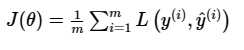
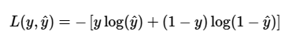
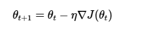
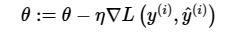
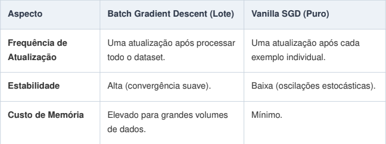

# Otimização Primitiva

## Função de Perda e Gradiente

Na otimização primitiva, o objetivo é encontrar o vale mais baixo em uma paisagem matemática.

**Função de Perda (Loss Function):** É a régua que mede o erro do modelo. Para Regressão Logística, usamos a Entropia Cruzada Binária (Log Loss). Ela penaliza severamente previsões confiantes que estão erradas.

**Gradiente:** É o vetor de derivadas parciais da função de perda em relação aos pesos e ao viés.

**Direção:** O gradiente aponta para a subida mais íngreme.

**Sentido oposto:** Para minimizar o erro, caminhamos na direção oposta ao gradiente.

## SGD Puro (Vanilla SGD) vs GD em Lote

### Fórmula do Gradient Descent em Lote (Batch GD)

### Stochastic Gradient Descent (SGD)

### Diferença Principal

- Batch GD: usa todas as amostras.
- SGD: usa apenas uma amostra por vez.

## O Papel da Taxa de Aprendizado ($\eta$)

A taxa de aprendizado (learning rate) define o tamanho do salto que damos na superfície de erro.

**$\eta$ muito pequeno:** O modelo leva muito tempo para convergir e pode parecer estagnado antes de alcançar uma boa solução.

**$\eta$ muito grande:** O modelo pode pular por cima do mínimo global, divergir e nunca encontrar a solução.

**Região de Estabilidade:** É o intervalo de valores de $\eta$ onde o algoritmo consegue reduzir a perda de forma consistente. Se o passo for maior que a curvatura da superfície permite, o sistema entra em oscilação instável.

## Superfícies de Erro Complexas e o Problema da Convergência

### Superfícies Simples (Convexas)

Na Regressão Logística linear padrão, a superfície de erro é convexa (parece uma tigela). Isso é uma ótima notícia: qualquer mínimo local é também o mínimo global.

### Superfícies Complexas e Ravinas

Em modelos mais profundos (Redes Neurais), a superfície é cheia de vales e picos.

**Mínimos Locais:** Pontos onde o gradiente é zero, mas não são o menor erro possível.

**Pontos de Sela (Saddle Points):** Onde a superfície é plana em uma direção e curva em outra. O GD tradicional pode avançar lentamente nessas regiões.

**Ravinas:** São vales longos e estreitos. O SGD puro tende a oscilar violentamente entre as paredes da ravina (ziguezague) em vez de descer rapidamente pelo centro do vale.

## Convergência em Superfícies Complexas

Apesar do caminho ruidoso, o SGD tem boas propriedades de convergência se $\eta$ for reduzido gradualmente (Learning Rate Scheduling). O ruído estocástico atua como uma força exploratória, podendo ajudar o otimizador a atravessar pequenos obstáculos e regiões planas.

## Definição Operacional: SGD Puro vs. GD em Lote

Para consolidar a implementação e a análise do algoritmo em um ambiente de pesquisa, é necessário traduzir a diferença conceitual entre o Gradient Descent (GD) tradicional e o Stochastic Gradient Descent (SGD) em suas equações operacionais e impactos de complexidade computacional.

### Gradient Descent em Lote (Batch GD)

Esta abordagem calcula o gradiente da função de custo computando a média dos erros de todo o conjunto de dados (de tamanho $N$) antes de realizar um único passo de ajuste nos parâmetros do modelo.

**Impacto Computacional:** Embora proporcione uma trajetória de convergência suave, estável e precisa em direção ao mínimo, cada atualização exige processar as $N$ amostras. O consumo de memória depende da implementação: o gradiente pode ser acumulado sem armazenar todo o conjunto simultaneamente, enquanto implementações vetorizadas podem manter lotes grandes em memória.

### SGD Puro (Vanilla SGD)

Em contrapartida, o SGD em sua forma pura realiza uma atualização imediata nos parâmetros baseando-se estritamente em uma única amostra, extraída aleatoriamente do dataset.

**Impacto Computacional:** O algoritmo torna-se extremamente leve por atualizar os pesos a cada instância processada, embora introduza uma alta variância e ruído ao longo do gradiente. A memória usada por uma atualização individual não cresce com o número total de amostras, desconsiderando o armazenamento do próprio conjunto de dados e dos parâmetros.

## A Região de Estabilidade da Taxa de Aprendizado ($\eta$)

A natureza ruidosa das atualizações do SGD Puro exige um controle rigoroso sobre a taxa de aprendizado ($\eta$), que deve operar dentro de uma região de estabilidade.

A curvatura da função de perda influencia o limite de estabilidade. No caso particular do Gradient Descent em uma função quadrática convexa, com maior autovalor $\lambda_{\max}$ da Hessiana, uma condição clássica para a taxa constante é:

$$
0<\eta<\frac{2}{\lambda_{\max}}
$$

Se o valor de $\eta$ exceder o limite permitido pela geometria da superfície, o sistema pode entrar em um regime de oscilação instável e a função de perda pode divergir.

## A Lógica Estrutural do Fluxo de Otimização

Para operacionalizar o SGD Puro de forma eficiente, o fluxo lógico do algoritmo divide-se em três etapas estratégicas essenciais:

### Embaralhamento Aleatório (Shuffle)

No início de cada época de processamento, as instâncias do dataset devem ser completamente reordenadas. Sem esse mecanismo, o SGD perde sua propriedade estocástica inerente e o modelo corre o risco de viciar na sequência física em que os dados foram armazenados.

### Análise Unitária Sequencial

O algoritmo isola uma única linha de dados por vez para realizar o forward pass (cálculo da predição local) e o backward pass (computação analítica do gradiente para aquela amostra específica).

### Atualização Instantânea

Os parâmetros são corrigidos no mesmo instante em que o gradiente da amostra é calculado. Dessa forma, a amostra subsequente do ciclo já será avaliada por um vetor de pesos ligeiramente atualizado, acelerando a dinâmica do aprendizado.

## Referências Bibliográficas

- GOODFELLOW, Ian; BENGIO, Yoshua; COURVILLE, Aaron. Deep Learning. Cambridge: MIT Press, 2016.
- ROBBINS, Herbert; MONRO, Sutton. A Stochastic Approximation Method. The Annals of Mathematical Statistics, v. 22, n. 3, p. 400-407, 1951.
- BOTTOU, Léon. Stochastic Gradient Descent Tricks. Neural Networks: Tricks of the Trade. Lecture Notes in Computer Science, v. 7700, p. 421-436. Springer, Berlin, Heidelberg, 2012.

## Colaboradores

| | |
|:---:|:---:|
|  Lucas Schemes |  Daiana Brum |
