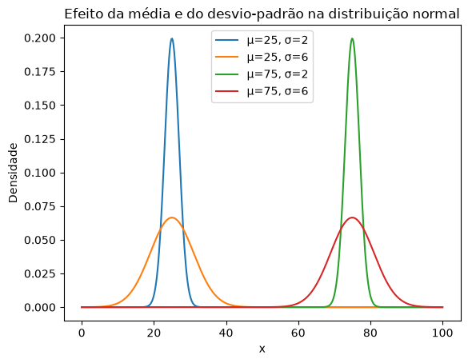
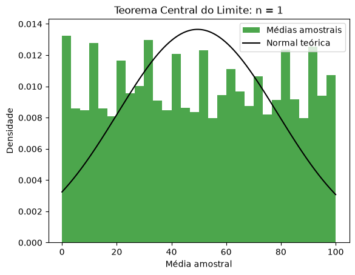
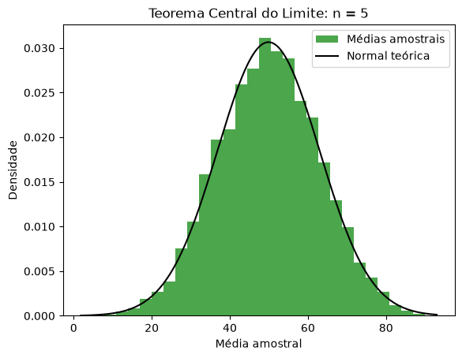
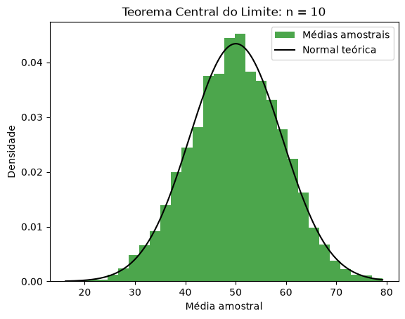
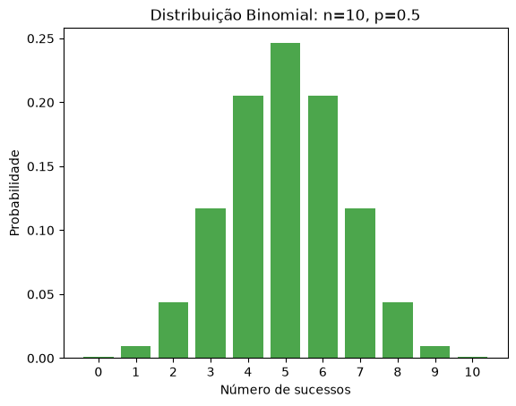

- [Estatística e Análise Exploratória](#h1)
    - [Dispersão e Distribuição dos Dados](#h2)
        - [Variância](#h3_0)  
        - [Desvio Padrão](#h3_1)    
        - [Quartis](#h3_2)    
        - [Intervalo interquartil](#h3_3)    
        - [Distribuição dos dados](#h3_4) 


# <a id='h1'></a> Estatística e Análise Exploratória

## <a id='h2'></a> Dispersão e Distribuição dos Dados

### <a id='h3_0'></a> Variância

A variância é uma medida estatística de dispersão que indica o quão distantes os valores de um conjunto de dados estão em relação à sua média.

Calculada pela média dos quadrados dos desvios de cada ponto em relação à média geral, ela reflete o grau de variabilidade ou volatilidade das observações:

- Quanto maior o seu valor, mais espalhados estão os dados;
- Quanto mais próximo de zero, mais homogêneos e concentrados ao redor da média eles se encontram.

Por expressar o resultado na unidade de medida dos dados ao quadrado, costuma-se extrair sua raiz quadrada para obter o desvio padrão, facilitando a interpretação direta no contexto analisado.

```python
import numpy as np
import pandas as pd
from typing import Literal

def var(dados, grau_de_liberdade: Literal[0, 1] = 0) -> float:

    """
        Calcula a variância de um conjunto de dados numéricos.

        - Use grau_de_liberdade=0 para variância populacional
        - Use grau_de_liberdade=1 para variância amostral 

    """
    n = len(dados)

    if n == 0:
        raise ValueError('Conjunto de dados vazio')
    elif n - grau_de_liberdade == 0:
        raise ZeroDivisionError('Tamnho dos dados insuficiente para o grau de liberdade')
    
    media = sum(dados)/n

    numerador = sum([(xi - media)**2 for xi in dados])
    denominador = n - grau_de_liberdade
    return numerador/denominador
```

Variância Populacional: calcula a dispersão exata de todos os dados em relação à média quando se tem acesso à totalidade dos elementos de uma população.

$$ \text{Var}(X) = \frac{\sum_{i=1}^{n} (x_i - \bar{x})^2}{n} $$

[In]
```python
vetor = [1, 5, 8, 9, 4, 5, 6, 1, 2, 3, 4]
var(vetor)
```
[Out]
```text
6.231404958677686
```

Para comparar o resultado obtido, é utilizada a biblioteca Numpy, que permite calcular a variância tanto de um vetor quanto de uma matriz, podendo ainda especificar o eixo pelo parâmetro axis:

- axis = None: cálculo da variância de todos os elementos
- axis = 0: cálculo da variância das colunas
- axis = 1: cálculo da variância das linhas

[In]
```python
np.var(vetor)
```
[Out]
```text
np.float64(6.231404958677686)
```

[In]
```python
matriz = [
    [1, 5, 6],
    [5, 8, 9],
    [7, 5, 8]
]

np.var(matriz) # variância de todos os elementos
```
[Out]
```text
np.float64(5.111111111111111)
```

[In]
```python
np.var(matriz, axis=0) # variância dos elementos de cada coluna
```
[Out]
```text
array([6.22222222, 2.        , 1.55555556])
```

[In]
```python
np.var(matriz, axis=1) # variância dos elementos de cada linha
```
[Out]
```text
array([4.66666667, 2.88888889, 1.55555556])
```

Variância Amostral: É a estimativa da dispersão populacional calculada a partir de um subconjunto de dados, aplicando a correção para compensar a subestimativa do desvio em relação à média amostral.

$$ \text{Var}(X) = \frac{\sum_{i=1}^{n} (x_i - \bar{x})^2}{n - \text{ddof}} $$

No qual ddof representa o grau de liberdade.


```python
amostra = vetor[:3]
```

Assim como anteriormente, a função var da biblioteca Numpy também possui o parâmetro ddof, permitindo especificar o grau de liberdade.

```python
var(amostra, grau_de_liberdade=1)
```
[Out]
```text
np.float64(12.333333333333332)
```

Outra biblioteca importante na área de dados é o Pandas, que também permite cálculo da variância de uma Series ou DataFrame, ou seja, um conjunto de dados unidimensional ou bidimensional semelhante ao nosso vetor e à nossa matriz.

[In]
```python
serie = pd.Series(vetor)
serie
```
[Out]
```text
0     1
1     5
2     8
3     9
4     4
5     5
6     6
7     1
8     2
9     3
10    4
dtype: int64
```

[In]
```python
df = pd.DataFrame(matriz, columns=['col_1', 'col_2', 'col_3'])
df
```
[Out]
|   | col_1 | col_2 | col_3 |
| - | :---: | :---: | :---: |
| 0 |   1   |   5   |   6   |
| 1 |   5   |   8   |   9   |
| 2 |   7   |   5   |   8   |

Para calcular a variância de todos os elementos, é preciso especificar o parâmetro axis:

- axis = None: cálculo da variância de todos os elementos
- axis = 0: cálculo da variância das colunas
- axis = 1: cálculo da variância das linhas

Para escolher o grau de liberdade, é preciso especificar o parâmetro ddof.


[In]
```python
serie.var(ddof=0) # variância populacional
```
[Out]
```text
np.float64(6.231404958677686)
```

[In]
```python
serie[:3].var(ddof=1) # variância amostral
```
[Out]
```text
np.float64(12.333333333333332)
```

[In]
```python
df.var(axis=None, ddof=0) # variância populacional de todos os elementos
```
[Out]
```text
np.float64(5.111111111111111)
```

[In]
```python
df.var(axis=None, ddof=0) # variância populacional de todos os elementos
```
[Out]
```text
np.float64(5.111111111111111)
```

[In]
```python
df.var(ddof=0) # variância populacional para as colunas
```
[Out]
|   |  |  
| - | :---: | 
| col_1 |   6.222222   |
| col_2 |   2.000000   |
| col_3 |   1.555556   |

[In]
```python
df.var(ddof=0, axis=1) # variância populacional para as linhas
```
[Out]
|   |  |  
| - | :---: | 
| 0 |   4.666667   |
| 1 |   2.888889   |
| 2 |   1.555556   |

[In]
```python
df.var(axis=None, ddof=1) # variância amostral de todos os elementos
```
[Out]
```text
np.float64(5.75)
```
[In]
```python
df.var(ddof=1) # variância amostral para as colunas
```
[Out]
|   |  |  
| - | :---: | 
| col_1 |   9.333333   |
| col_2 |   3.000000   |
| col_3 |   2.333333   |

[In]
```python
df.var(ddof=1, axis=1) # variância amostral para as linhas
```
[Out]
|   |  |  
| - | :---: | 
| 0 |   7.000000   |
| 1 |   4.333333   |
| 2 |   2.333333   |

### <a id='h3_1'></a> Desvio Padrão

Como a variância expressa o resultado em unidades ao quadrado, a extração de sua raiz quadrada nos fornece o Desvio Padrão. Essa transformação traz a medida de dispersão de volta para a mesma unidade de medida dos dados originais, tornando a interpretação direta, intuitiva e aplicável ao contexto analisado.

- Baixo desvio padrão: dados tendem a estar agrupados próximos da média
- Alto desvio padrão: dados estão espalhados por uma faixa mais ampla de valores

$$ \text{Std}(X) = \sqrt{\text{Var}(X)} = \sqrt{\frac{\sum_{i=1}^{n} (x_i - \bar{x})^2}{n - \text{ddof}}} $$

O desvio padrão populacional utiliza a variância populacional: ddof = 0

Enquanto o desvio padrão amostral utiliza a variância amostral: ddof = 1


```python
def std(dados, grau_de_liberdade: Literal[0, 1] = 0) -> float:
    """
        Calcula o desvio padrão de um conjunto de dados numéricos.

        - Use grau_de_liberdade=0 para desvio padrão populacional
        - Use grau_de_liberdade=1 para desvio padrão amostral 

    """
    return var(dados, grau_de_liberdade)**(1/2)
```

Comparação com as bibliotecas Numpy e Pandas

[In]
```python
std(vetor), np.std(vetor), serie.std(ddof=0) # desvio padrão populacional
```
[Out]
```text
(2.4962782214083603,
 np.float64(2.4962782214083603),
 np.float64(2.4962782214083603))
``` 

[In]
```python
np.std(matriz), df.std(ddof=0, axis=None) # desvio padrão populacional para todos os elementos da matriz
```
[Out]
```text
(np.float64(2.260776661041756), np.float64(2.260776661041756))
``` 

[In]
```python
std(vetor, grau_de_liberdade=1), np.std(vetor, ddof=1),  serie.std(ddof=1) # desvio padrão amostral
```
[Out]
```text
(2.618118686107537,
 np.float64(2.618118686107537),
 np.float64(2.618118686107537))
```

[In]
```python
np.std(matriz, ddof=1), df.std(ddof=1, axis=None) # desvio padrão amostral para todos os elementos da matriz
```
[Out]
```text
(np.float64(2.3979157616563596), np.float64(2.3979157616563596))
```

### <a id='h3_2'></a> Quartis

Quartis são valores que dividem um conjunto de dados ordenado em quatro partes iguais, onde cada parte contém 25% das observações.

- O primeiro quartil (Q1), ou quartil inferior, delimita os 25% menores valores do conjunto

- O segudo quartil (Q2) delimita os 50%, coincide exatamente com a mediana

- O terceiro quartil (Q3) 75% é chamado de quartil superior porque é o último corte, já que o quarto quartil corresponde ao valor máximo 100% de todo o conjunto de dadoss

Essa métrica estatística é fundamental para analisar a distribuição, a dispersão e a presença de valores discrepantes (outliers) em dados quantitativos.

[In]
```python
dados = np.arange(0, 101, 5)
dados
```
[Out]
```text
array([  0,   5,  10,  15,  20,  25,  30,  35,  40,  45,  50,
        55,  60, 65,  70,  75,  80,  85,  90,  95, 100])
```


```python
def quartis(dados) -> tuple[float, float, float, float]:
    """
        Retorna os quartis Q1, Q2, Q3, Q4 dos dados.
        Ou seja, os cortes que limitam 25%, 50%, 75% e 100% dos dados ordenados.
    """

    Q1 = np.quantile(dados, 0.25)
    Q2 = np.quantile(dados, 0.50)
    Q3 = np.quantile(dados, 0.75)
    Q4 = np.quantile(dados, 1)
    return Q1, Q2, Q3, Q4
```

[In]
```python
Q1, Q2, Q3, Q4 = quartis(dados)
Q1, Q2, Q3, Q4
```
[Out]
```text
(np.float64(25.0), np.float64(50.0), np.float64(75.0), np.int64(100))
```

[In]
```python
Q2, np.median(dados)
```
[Out]
```text
(np.float64(50.0), np.float64(50.0))
```

[In]
```python
dados_aleatorios = np.random.randint(0, 101, size=(50, 50))
Q1, Q2, Q3, Q4 = quartis(dados_aleatorios)
Q1, Q2, Q3, Q4
```
[Out]
```text
(np.float64(25.0), np.float64(50.5), np.float64(76.0), np.int32(100))
```

Na biblioteca Pandas também possui o método quantile. Porém utiliza-se com mais frequente o método describe que resume algumas das métricas mais importantes, incluindo os quartis. 

[In]
```python
serie = pd.Series(dados)
serie
```
[Out]
```text
0       0
1       5
2      10
3      15
4      20
5      25
6      30
7      35
8      40
9      45
10     50
11     55
12     60
13     65
14     70
15     75
16     80
17     85
18     90
19     95
20    100
dtype: int64
```

[In]
```python
serie.quantile(0.25), serie.quantile(0.50), serie.quantile(0.75)
```
[Out]
```text
(np.float64(25.0), np.float64(50.0), np.float64(75.0))
```

[In]
```python
serie.describe()
```
[Out]
|   |  |  
| - | :---: | 
| count |  21.000000 |
| mean  |  50.000000 |
| std   |  31.024184 |
| min   |   0.000000 |
| 25%   |  25.000000 |
| 50%   |  50.000000 |
| 75%   |  75.000000 |
| max   |  100.000000|


### <a id='h3_3'></a> Intervalo interquartil

O Intervalo Interquartil (IQR) é a diferença entre o terceiro quartil (Q3) e o primeiro quartil (Q1).

$$ \text{IQR} = {\text{Q3}} - {\text{Q1}} $$

O IQR mede a amplitude da metade central dos seus dados, os 50% das observações que ficam exatamente no meio do conjunto, ignorando os 25% menores e os 25% maiores.

Diferente do desvio padrão ou da amplitude total, o IQR não é afetado por valores extremos ou discrepantes (outliers). 

```python
def intervalo_interquartil(dados) -> float:
    """
        Calcula o intervalo interquartil (IQR).

        IQR = Q3 - Q1

        Onde Q1 é o corte representativo dos 25% dos dados ordenados
        e Q3 é dos 75%.
    """

    Q1 = np.quantile(dados, 0.25)
    Q3 = np.quantile(dados, 0.75)

    return Q3 - Q1
```
[In]
```python
intervalo_interquartil(dados)
```
[Out]
```
np.float64(50.0)
```

### <a id='h3_4'></a> Distribuição dos dados

A análise da distribuição de dados é essencial para compreender como os valores de uma variável se comportam, revelando sua concentração, variabilidade e simetria.

Enquanto a estatística descritiva utiliza métricas como variância, desvio padrão e intervalo interquartil para quantificar a dispersão e identificar a presença de valores discrepantes (outliers) em dados observados, os modelos probabilísticos teóricos, como as distribuições Normal e Binomial, fornecem a base matemática para modelar esses comportamentos.

```python
import matplotlib.pyplot as plt
```
1. Distribuição Normal
A distribuição normal é uma distribuição de probabilidade contínua. 

Valores próximos da média apresentam maior densidade de probabilidade, enquanto valores mais distantes apresentam menor densidade.

Modelada pela seguinte fórmula:

$$ \text{f}(x) = \frac{1}{\sigma{}\sqrt{2\pi{}}} \mathrm{e}^{-\frac{1}{2}(\frac{\text{x} - \mu{}}{\sigma{}})^{2}} $$

No qual, $\sigma{}$ é o desvio padrão da população e $\mu{}$ é a média da população.

```python
def curva_distribuicao_normal(x, media, desvio_padrao):
    numerador = np.exp(-1/2 * ((x-media)/desvio_padrao)**2)
    denominador = desvio_padrao * (2*np.pi)**(1/2)
    return numerador/denominador
```

Uma distribuição normal é simétrica em torno da média.

Portanto, $\mu{}$ = mediana e os quartis ficam igualmente distantes da mediana.

O efeito da média e do desvio-padrão na curva:

- $\mu{}$ desloca a curva para esquerda ou para a direita
- $\sigma{}$ pequeno a curva é mais estreita e alta
- $\sigma{}$ grande a curva é mais larga e mais baixa

```python
def demonstra_parametros_curva_normal():
    x = np.linspace(0, 100, 500)

    parametros = [(25, 2), (25, 6),
                  (75, 2), (75, 6)]

    for media, desvio in parametros:
        y = curva_distribuicao_normal(x, media, desvio)
        plt.plot(x, y, label=f'μ={media}, σ={desvio}')

    plt.title('Efeito da média e do desvio-padrão na distribuição normal')
    plt.xlabel('x')
    plt.ylabel('Densidade')
    plt.legend()
    plt.show()
```
[In]
```python
demonstra_parametros_curva_normal()
```
[Out]



O Teorema Central do Limite (TCL) afirma que, para amostras suficientemente grandes, a distribuição das médias amostrais tende a se aproximar de uma distribuição normal, independentemente da distribuição da população original.

Dessa forma, mesmo que os dados de uma população não apresentem comportamento normal, as médias de várias amostras dessa população tendem a formar uma curva aproximadamente normal à medida que o tamanho das amostras aumenta.

```python
def demonstrar_tcl(n, numero_amostras=10_000):
    amostras = np.random.randint(0, 101, size=(numero_amostras, n))

    medias = np.mean(amostras, axis=1)

    media = np.mean(amostras)
    desvio = np.std(amostras) / (n**(1/2))

    x = np.linspace(np.min(medias), np.max(medias), 500)
    y = curva_distribuicao_normal(x, media, desvio)

    plt.hist(medias, bins=30, density=True,
             alpha=0.7, color='green', label='Médias amostrais')

    plt.plot(x, y, color='black', label='Normal teórica')

    plt.title(f'Teorema Central do Limite: n = {n}')
    plt.xlabel('Média amostral')
    plt.ylabel('Densidade')
    plt.legend()
    plt.show()
```

[In]
```python
for n in [1, 5, 10]:
    demonstrar_tcl(n)
```
[Out]







2. Distribuição Binomial

A distribuição binomial é uma distribuição de probabilidade discreta utilizada para representar o número de sucessos obtidos em um número fixo de tentativas independentes, nas quais existem apenas dois resultados possíveis: sucesso ou fracasso.

Ela é determinada pelo número de tentativas n e pela probabilidade de sucesso p. Diferentemente da distribuição normal, que é contínua, a distribuição binomial assume apenas valores inteiros, de 0 até n.

Sua forma pode variar de acordo com n e p, podendo apresentar maior ou menor simetria dependendo da probabilidade de sucesso.

$$P(X = k) = \binom{n}{k}p^{k}(1 - p)^{n-k}$$

$$\binom{n}{k}=\frac{n!}{k!(n-k)!}$$

```python
import math

def distribuicao_binomial(n, p, k):
    numero_binomial = math.factorial(n)/(math.factorial(k)*math.factorial(n-k))
    return numero_binomial*p**k*(1-p)**(n-k)
```

Exemplo:

Uma moeda equilibrada é lançada 10 vezes. Qual é a probabilidade de obter exatamente 3 caras?

[In]
```python
n = 10
k = 3
p = 0.50

P = distribuicao_binomial(n, p, k) * 100
f'{round(P, 1)}%'
```
[Out]
```
11.7%
```

```python
def plot_distribuicao_binomial(n, p):
    ks = np.arange(0, n + 1)

    probabilidades = [distribuicao_binomial(n, p, ki) for ki in ks]

    plt.bar(ks, probabilidades, color='green', alpha=0.7)

    plt.xlabel('Número de sucessos')
    plt.ylabel('Probabilidade')
    plt.title(f'Distribuição Binomial: n={n}, p={p}')

    plt.xticks(ks)
    plt.show()
```
[In]
```python
plot_distribuicao_binomial(n, p)
```
[Out]


