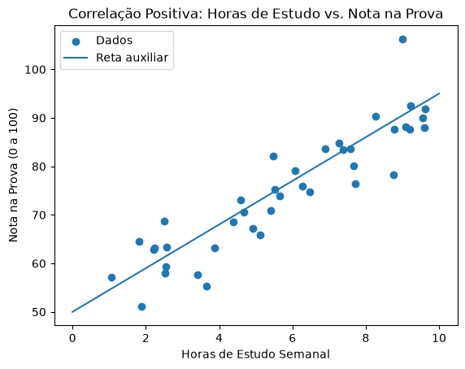
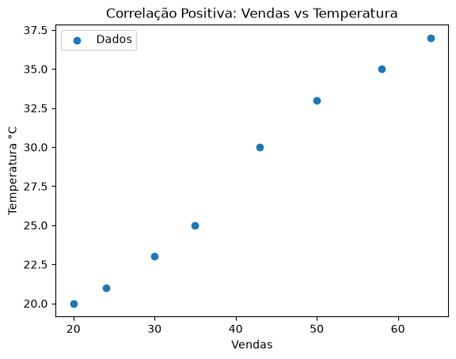
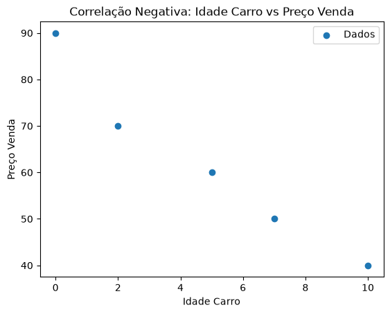
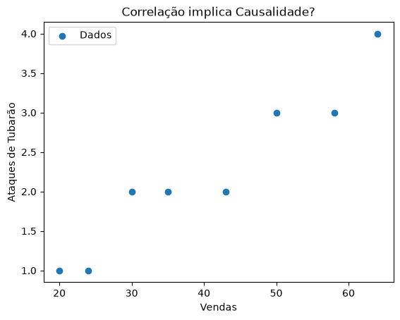

- [Estatística e Análise Exploratória](#h1)
    - [Relações entre Variáveis](#h2)
        - [Correlação e Covariância](#h3_0)
        - [Correlação positiva e negativa](#h3_1)
        - [Interpretação da correlação](#h3_2)
        - [Correlação não implica causalidade](#h3_3)

# <a id='h1'></a> Estatística e Análise Exploratória

```python
import numpy as np
import pandas as pd
import matplotlib.pyplot as plt
```

## <a id='h2'></a> Relações entre Variáveis

### <a id='h3_0'></a> Covariância e Correlação

Covariância é uma medida estatística que indica como duas variáveis variam juntas, mostrando se elas tendem a aumentar ou diminuir simultaneamente.

É de mais difícil interpretação porque a escala depende das unidades dos dados, enquanto a correlação é uma medida normalizada do grau e direção da relação entre duas ou mais variáveis.

Relação entre covariância e correlação:

$$r = \frac{Cov(X,Y)}{\sigma{}_X\sigma{}_Y} $$

```python
horas_estudo = np.random.uniform(1, 10, 40)

notas = 50 + 4.5 * horas_estudo + np.random.normal(0, 5, 40)
```
[In]
```python
df = pd.DataFrame({'Horas de Estudo': horas_estudo,
                   'Nota na Prova': notas})
```
[Out]

| ID | Horas de Estudo | Nota na Prova |
| --- | --- | --- |
| 0 | 5.520430 | 75.300070 |
| 1 | 6.069648 | 79.123896 |
| 2 | 4.681663 | 70.624711 |
| 3 | 5.410863 | 70.862401 |
| 4 | 4.922302 | 67.266873 |
| 5 | 3.866927 | 63.188483 |
| 6 | 8.753682 | 78.275561 |
| 7 | 4.376507 | 68.493913 |
| 8 | 7.392188 | 83.520083 |
| 9 | 7.575244 | 83.606568 |
| 10 | 9.619465 | 91.899739 |
| 11 | 6.886153 | 83.682254 |
| 12 | 9.203007 | 87.730851 |
| 13 | 8.992732 | 106.302241 |
| 14 | 7.268514 | 84.731741 |
| 15 | 2.226439 | 63.177832 |
| 16 | 3.645473 | 55.354461 |
| 17 | 1.875434 | 51.051893 |
| 18 | 6.264256 | 75.923191 |
| 19 | 7.719601 | 76.497669 |
| 20 | 1.069545 | 57.108223 |
| 21 | 9.590070 | 87.937039 |
| 22 | 8.780509 | 87.615407 |
| 23 | 9.223153 | 92.570025 |
| 24 | 2.532317 | 57.963005 |
| 25 | 5.125615 | 65.861119 |
| 26 | 2.223052 | 62.820909 |
| 27 | 2.570096 | 63.348937 |
| 28 | 1.816075 | 64.579543 |
| 29 | 5.467166 | 82.158812 |
| 30 | 9.561508 | 90.013019 |
| 31 | 2.495240 | 68.724743 |
| 32 | 2.545220 | 59.414552 |
| 33 | 5.658943 | 73.829138 |
| 34 | 9.092348 | 88.085589 |
| 35 | 3.417062 | 57.689446 |
| 36 | 7.671665 | 80.144699 |
| 37 | 6.477425 | 74.703043 |
| 38 | 8.260443 | 90.358860 |
| 39 | 4.576699 | 73.144986 |

[In]
```python
r = df['Horas de Estudo'].corr(df['Nota na Prova'])\n",
r
```
[Out]
```
np.float64(0.9088370544918011)
```

[In]
```python
cov = df['Horas de Estudo'].cov(df['Nota na Prova'])\n",
cov
```
[Out]
```
np.float64(30.092701191489)
```

[In]
```python
std_X = df['Horas de Estudo'].std()
std_Y = df['Nota na Prova'].std()

r = cov/(std_X*std_Y)
r
```
[Out]
```
np.float64(0.9088370544918011)
```

[In]
```python
x = np.linspace(0, 10, 100)
y = 50 + 4.5 * x
```

```python
plt.scatter(df['Horas de Estudo'], df['Nota na Prova'], label='Dados')
plt.plot(x, y, label='Reta auxiliar')
plt.title('Correlação Positiva: Horas de Estudo vs. Nota na Prova')
plt.xlabel('Horas de Estudo Semanal')
plt.ylabel('Nota na Prova (0 a 100)')
plt.legend()
plt.show()
```




### <a id='h3_1'></a> Correlação positiva e negativa

Correlação Positiva: Ocorre quando o coeficiente de correlação é positivo.

Quando uma variável aumenta, a outra tende a aumentar.
Quando uma variável diminui, a outra tende a diminuir.

[In]
```python
T = [20, 21, 23, 25, 30, 33, 35, 37]
vendas = [20, 24, 30, 35, 43, 50, 58, 64]

df = pd.DataFrame({'Temperatura °C': T,
                   'Vendas': vendas})
df
```
[Out]

| ID | Temperatura °C | Vendas |
| --- | --- | --- |
| 0 | 20 | 20 |
| 1 | 21 | 24 |
| 2 | 23 | 30 |
| 3 | 25 | 35 |
| 4 | 30 | 43 |
| 5 | 33 | 50 |
| 6 | 35 | 58 |
| 7 | 37 | 64 |


[In]
```python
r = df['Temperatura °C'].corr(df['Vendas'])
r
```
[Out]
```
np.float64(0.9936715797067378)
```

[In]
```python
plt.scatter(df['Vendas'], df['Temperatura °C'], label='Dados')
plt.title('Correlação Positiva: Vendas vs Temperatura')
plt.xlabel('Vendas')
plt.ylabel('Temperatura °C')
plt.legend()
plt.show()
```




Correlação Negativa: Ocorre quando o coeficiente de correlação é negativo.

Quando uma variável aumenta, a outra tende a diminuir.
Quando uma variável diminui, a outra tende a aumentar.

[In]
```python
idade_carro = [0, 2, 5, 7, 10]
preco_venda = [90, 70, 60, 50, 40]

df = pd.DataFrame({'Idade Carro': idade_carro,
                   'Preço Venda': preco_venda})
df
```
[Out]

| ID | Idade Carro | Preço Venda |
| --- | --- | --- |
| 0 | 0 | 90 |
| 1 | 2 | 70 |
| 2 | 5 | 60 |
| 3 | 7 | 50 |
| 4 | 10 | 40 |


[In]
```python
r = df['Idade Carro'].corr(df['Preço Venda'])
r
```
[Out]
```
np.float64(-0.9774748331318276)
```

[In]
```python
plt.scatter(df['Idade Carro'], df['Preço Venda'], label='Dados')
plt.title('Correlação Negativa: Idade Carro vs Preço Venda')
plt.xlabel('Idade Carro')
plt.ylabel('Preço Venda')
plt.legend(),
plt.show()
```



### <a id='h3_2'></a>Interpretação da correlação

A correlação permite avaliar a intensidade e a direção da relação linear entre duas variáveis. Seu coeficiente, representado por r, varia entre -1 e 1.

Valores de r próximos de 1 indicam uma correlação positiva, enquanto valores próximos de -1 indicam uma correlação negativa.

Quando r está próximo de zero, há pouca ou nenhuma relação linear entre as variáveis. Quanto mais próximo de 1 ou -1 estiver o coeficiente, mais forte é a associação linear observada.

Assim, a interpretação da correlação deve considerar tanto seu sinal, que indica a direção da relação, quanto seu valor absoluto, que indica sua intensidade.

É importante ressaltar que a correlação descreve uma associação entre variáveis e não implica necessariamente uma relação de causa e efeito."

### <a id='h3_3'></a> Correlação não implica causalidade

A existência de uma correlação entre duas variáveis não significa necessariamente que uma delas seja responsável pela alteração da outra.

A correlação indica apenas que existe uma associação entre as variáveis, mostrando que elas tendem a variar de determinada maneira. Essa relação pode ocorrer devido à influência de uma terceira variável, à coincidência ou a outros fatores não considerados na análise.

Portanto, para estabelecer uma relação de causa e efeito, são necessários métodos adicionais, como experimentos controlados ou análises estatísticas específicas que permitam controlar possíveis variáveis de confusão.

Dessa forma, a correlação deve ser interpretada como um indicativo de associação, e não como uma comprovação de causalidade.


```python
T = [20, 21, 23, 25, 30, 33, 35, 37]
vendas = [20, 24, 30, 35, 43, 50, 58, 64]
ataque_tubarao = [1, 1, 2, 2, 2, 3, 3, 4]


df = pd.DataFrame({'Temperatura °C': T,
                   'Vendas': vendas,
                   'Ataques de Tubarão': ataque_tubarao})
```

[In]
```python
r = df['Vendas'].corr(df['Ataques de Tubarão'])
r
```
[Out]
```
np.float64(0.9585363562790536)
```

[In]
```python
plt.scatter(df['Vendas'], df['Ataques de Tubarão'], label='Dados')
plt.title('Correlação implica Causalidade?')
plt.xlabel('Vendas')
plt.ylabel('Ataques de Tubarão')
plt.legend()
plt.show()
```





[In]
```python
df.corr()
```
[Out]

|  | Temperatura °C | Vendas | Ataques de Tubarão |
| --- | --- | --- | --- |
| Temperatura °C | 1.000000 | 0.993672 | 0.939336 |
| Vendas | 0.993672 | 1.000000 | 0.958536 |
| Ataques de Tubarão | 0.939336 | 0.958536 | 1.000000 |
