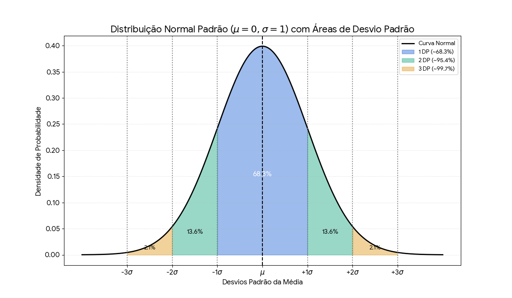
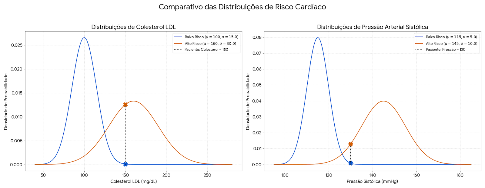

# English Version

## Gaussian Model (Gaussian Naive Bayes)

Until now, we have worked exclusively with **discrete variables**—that is, attributes that take on specific, countable values. In the case of the Multinomial and Bernoulli models, we dealt with word counts or binary presences (0 or 1).

However, many real-world problems involve data that is not countable, but rather measured, such as height, temperature, or price. This is where **Gaussian Naive Bayes** comes in.

> [!NOTE]
> **Essential Difference: Discrete vs. Continuous Variables [3]**
>
> - **Discrete Variables**: Assume specific, countable values. Examples: number of words, presence/absence of features, number of clicks.
> - **Continuous Variables**: Can assume any value within an interval. Examples: height, weight, temperature, price, speed.
>
> This distinction is fundamental, as the way of calculating the "chance" of a value occurring changes completely between the two types.

### When to Use the Gaussian Model

**Gaussian Naive Bayes** is the ideal classifier variant when your attributes are **continuous variables**. It assumes that, for each class, the values of an attribute follow a normal (also known as Gaussian) distribution [3].

Typical examples of use include [2]:

- **Medical diagnosis**: Classifying patients based on height, weight, blood pressure, or cholesterol levels.
- **Financial sector**: Predicting credit risk based on income, age, or loan amount.
- **Sensors and IoT**: Identifying anomalies based on temperature, humidity, or speed measurements.

### Fundamental Concepts: Mean and Variance

Before we dive into the model, we need to review two statistical concepts that are the basis of the normal distribution:

#### Mean ($\mu$)
The **mean** is the center of gravity of the data, representing the central or "typical" value of a set [1].

$$\mu = \frac{1}{n} \sum_{i=1}^{n} x_i$$

#### Variance ($\sigma^2$)
**Variance** measures the spread of the data around the mean. A high variance indicates that the data are very spread out; a low variance means they are concentrated near the mean. The **standard deviation** ($\sigma$) is the square root of the variance [1].

$$\sigma^2 = \frac{1}{n-1} \sum_{i=1}^{n} (x_i - \mu)^2$$

>[!NOTE]
>**Sample Variance in Machine Learning [1]**
>
>In ML, we always work with samples (not complete populations), so we use the sample variance with division by (n-1), known as Bessel's correction. This avoids bias in small sets and provides a more accurate estimate of the real population variance.

### Normal (Gaussian) Distribution

The normal distribution is perhaps the most famous in statistics, recognized for its symmetrical **bell curve** shape. It describes many natural phenomena and processes where values tend to cluster around a central mean. Most values are close to the mean, and values farther away (both higher and lower) become progressively rarer [1].

To calculate the curve, we use the **probability density function** (PDF). This function gives us the height of the curve at any point $x$ [4]:

$$f(x|\mu, \sigma^2) = \frac{1}{\sqrt{2\pi\sigma^2}} e^{-\frac{(x-\mu)^2}{2\sigma^2}}$$

The image shows the **standard normal distribution** (μ = 0, σ = 1) with its characteristic symmetric bell shape. The colored areas illustrate the **68-95-99.7 rule**:

- **68.3%** of the data are within 1 standard deviation of the mean (blue area)
- **95.4%** are within 2 standard deviations (blue + green)
- **99.7%** are within 3 standard deviations (blue + green + orange)

The dotted vertical lines mark the standard deviation intervals (-3σ to +3σ), demonstrating how the probability decreases as we move away from the center of the distribution.

> [!IMPORTANT]
> **Likelihood is the Height of the Curve [2]!**
>
> Here is a crucial concept shift compared to the Bernoulli and Multinomial models.
>
> - In **discrete** models, the likelihood $P(\text{word}|\text{class})$ was a real and direct probability.
> - In **continuous** models, the probability of an *exact* value occurring is zero ($P(X=x) = 0$).
>
> So, what do we use? We use the **likelihood**, which for the Gaussian distribution is the value of the density function $f(x)$ at the point of interest.
>
> Think of it as the **height of the curve** at the exact point of your data. A greater height means that the data is more "compatible" or "plausible" with that class distribution. Naive Bayes uses this height as a score to compare which class better explains the observed data.

### Gaussian Naive Bayes Classifier

The classification process with Gaussian Naive Bayes follows the same logic as always, but with a different likelihood calculation.

1.  **Training**: For each class $C$ and each continuous attribute $X_i$:
    * Calculate the mean of that attribute for all examples of class $C$: $\mu_{i,C}$
    * Calculate the variance of that attribute for all examples of class $C$: $\sigma_{i,C}^2$

2.  **Classification**: For a new data point with attributes $(x_1, x_2, ..., x_n)$, we calculate a score for each class using the Naive Bayes formula (usually on a logarithmic scale to avoid underflow) [4]:

$$\hat{C} = \arg\max_C \left[ \log P(C) + \sum_{i=1}^{n} \log f(x_i | \mu_{i,C}, \sigma_{i,C}^2) \right]$$

Where $f(x_i | ...)$ is the likelihood given by the normal distribution's density function we saw above.

### Practical Example: Cardiac Risk Classification

#### 1. The Problem

Let's classify patients into `Low Risk` or `High Risk` for cardiac complications based on two routine exams:

* `LDL Cholesterol (mg/dL)`
* `Systolic Blood Pressure (mmHg)`

#### 2. Class Profiles (Training)

Based on historical data, the model learned the following profiles (parameters) for each class:

**`Low Risk` Class**
* **LDL Cholesterol**: A healthy profile, with a mean $\mu = 100 \text{ mg/dL}$ and standard deviation $\sigma = 15$.
* **Blood Pressure**: A healthy and, crucially, **very consistent** profile. The mean is $\mu = 115 \text{ mmHg}$ with a standard deviation $\sigma = 5$.

**`High Risk` Class**
* **LDL Cholesterol**: An elevated mean of $\mu = 160 \text{ mg/dL}$ and standard deviation $\sigma = 30$.
* **Blood Pressure**: An elevated mean of $\mu = 145 \text{ mmHg}$ and standard deviation $\sigma = 10$.

#### 3. Patient for Analysis

A new patient arrives with the following results:

* **LDL Cholesterol**: 150 mg/dL
* **Blood Pressure**: 130 mmHg

#### 4. Graphical Analysis and Likelihood Calculation

Below are the graphs of the four distributions, with an "X" marking where our patient's data fall.

Let's analyze the numbers behind the graphs, calculating the likelihood (the height of the curve at the patient's point) for each case.

#### Detailed Calculations

Let's apply the probability density function (PDF) to find the likelihood (the height of the curve) for each attribute in each class. The formula we will use in all cases is:

$$f(x|\mu, \sigma^2) = \frac{1}{\sqrt{2\pi\sigma^2}} e^{-\frac{(x-\mu)^2}{2\sigma^2}}$$

**1. Likelihood of Cholesterol for the `Low Risk` class**

* Patient's data: $x = 150$
* Class parameters: $\mu = 100$, $\sigma = 15$

$$f(150 | \mu=100, \sigma^2=15^2) = \frac{1}{\sqrt{2\pi \cdot 15^2}} e^{-\frac{(150-100)^2}{2 \cdot 15^2}} \approx 0.000103$$

**2. Likelihood of Pressure for the `Low Risk` class**

* Patient's data: $x = 130$
* Class parameters: $\mu = 115$, $\sigma = 5$

$$f(130 | \mu=115, \sigma^2=5^2) = \frac{1}{\sqrt{2\pi \cdot 5^2}} e^{-\frac{(130-115)^2}{2 \cdot 5^2}} \approx 0.000886$$

**3. Likelihood of Cholesterol for the `High Risk` class**

* Patient's data: $x = 150$
* Class parameters: $\mu = 160$, $\sigma = 30$

$$f(150 | \mu=160, \sigma^2=30^2) = \frac{1}{\sqrt{2\pi \cdot 30^2}} e^{-\frac{(150-160)^2}{2 \cdot 30^2}} \approx 0.012579$$

**4. Likelihood of Pressure for the `High Risk` class**

* Patient's data: $x = 130$
* Class parameters: $\mu = 145$, $\sigma = 10$

$$f(130 | \mu=145, \sigma^2=10^2) = \frac{1}{\sqrt{2\pi \cdot 10^2}} e^{-\frac{(130-145)^2}{2 \cdot 10^2}} \approx 0.012952$$

**Summary of Likelihoods:**

> * **For the `Low Risk` class**:
>     * $f(\text{cholesterol}=150 | \text{Low Risk}) \approx 0.000103$
>     * $f(\text{pressure}=130 | \text{Low Risk}) \approx 0.000886$
>
> * **For the `High Risk` class**:
>     * $f(\text{cholesterol}=150 | \text{High Risk}) \approx 0.012579$
>     * $f(\text{pressure}=130 | \text{High Risk}) \approx 0.012952$

#### 5. Calculation of Scores and Final Decision

Now, we combine the likelihoods with the prior probability of each class to get a final score. The class with the highest score will be our prediction.

Assuming we have no prior information favoring one class, we use equal priors: $P(\text{Low Risk}) = P(\text{High Risk}) = 0.5$.

#### Score (Prior × Likelihood)

The formula for the score of each class is:

$$ \text{Score}(C) = P(C) \times f(\text{cholesterol}|C) \times f(\text{pressure}|C) $$

**For the `Low Risk` class**:
$$ \text{Score}(\text{Low Risk}) = 0.5 \times 0.000103 \times 0.000886 $$
$$ \text{Score}(\text{Low Risk}) \approx 0.0000000456 \text{ (or } 4.56 \times 10^{-8}\text{)} $$

**For the `High Risk` class**:
$$ \text{Score}(\text{High Risk}) = 0.5 \times 0.012579 \times 0.012952 $$
$$ \text{Score}(\text{High Risk}) \approx 0.00008146 \text{ (or } 8.146 \times 10^{-5}\text{)} $$

Since $0.00008146$ is much larger than $0.0000000456$, the model would choose the `High Risk` class.

#### Score on a Logarithmic Scale (Practical Calculation)

Note how the scores resulted in extremely small numbers. To avoid numerical precision problems (underflow) in problems with many attributes, the standard practice is to use the sum of logarithms, which preserves the order of the results and is computationally more stable.

The formula becomes:

$$ \text{Log-Score}(C) = \log P(C) + \log f(\text{cholesterol}|C) + \log f(\text{pressure}|C) $$

* **Score (Low Risk)**:
$\log(0.5) + \log(0.000103) + \log(0.000886) \approx -0.693 - 9.18 - 7.03 \approx \mathbf{-16.90}$

* **Score (High Risk)**:
$\log(0.5) + \log(0.012579) + \log(0.012952) \approx -0.693 - 4.37 - 4.35 \approx \mathbf{-9.42}$

#### 6. Conclusion

The score for **High Risk (-9.42)** is significantly larger (less negative) than that of Low Risk (-16.90), confirming our decision. The model classifies the patient as being **High Risk**.

## References

[1] Bishop, C. M. (2006). *Pattern recognition and machine learning*. Springer.

[2] Izbicki, R., & Santos, T. M. (2020). *Aprendizado de máquina: uma abordagem estatística*. (1st ed.). Rafael Izbicki.

[3] Hastie, T., Tibshirani, R., & Friedman, J. (2009). *The Elements of Statistical Learning*. Springer.

[4] Murphy, K. P. (2012). *Machine Learning: A Probabilistic Perspective*. MIT Press.

# Portuguese Version

## Modelo Gaussiano (Gaussian Naive Bayes)

Até agora, trabalhamos exclusivamente com **variáveis discretas**, isto é, atributos que assumem valores específicos e contáveis. No caso dos modelos Multinomial e Bernoulli, lidamos com contagens de palavras ou presenças binárias (0 ou 1).

No entanto, muitos problemas do mundo real envolvem dados que não são contáveis, mas sim medidos, como altura, temperatura ou preço. É aqui que entra o **Gaussian Naive Bayes**.

> [!NOTE]
> **Diferença Essencial: Variáveis Discretas vs. Contínuas [3]**
>
> - **Variáveis Discretas**: Assumem valores específicos e contáveis. Exemplos: número de palavras, presença/ausência de características, número de cliques.
> - **Variáveis Contínuas**: Podem assumir qualquer valor dentro de um intervalo. Exemplos: altura, peso, temperatura, preço, velocidade.
>
> Essa distinção é fundamental, pois a maneira de calcular a "chance" de um valor ocorrer muda completamente entre os dois tipos.

### Quando Usar o Modelo Gaussiano

O **Gaussian Naive Bayes** é a variante do classificador ideal quando seus atributos são **variáveis contínuas**. Ele assume que, para cada classe, os valores de um atributo seguem uma distribuição normal (também conhecida como gaussiana) [3].

Exemplos típicos de uso incluem [2]:

- **Diagnóstico médico**: Classificar pacientes com base em altura, peso, pressão arterial ou níveis de colesterol.
- **Setor financeiro**: Prever o risco de crédito com base em renda, idade ou valor de empréstimo.
- **Sensores e IoT**: Identificar anomalias com base em medições de temperatura, umidade ou velocidade.

### Conceitos Fundamentais: Média e Variância

Antes de mergulharmos no modelo, precisamos relembrar dois conceitos estatísticos que são a base da distribuição normal:

#### Média ($\mu$)
A **média** é o centro de gravidade dos dados, representando o valor central ou "típico" de um conjunto [1].

$$\mu = \frac{1}{n} \sum_{i=1}^{n} x_i$$

#### Variância ($\sigma^2$)
A **variância** mede a dispersão dos dados em torno da média. Uma variância alta indica que os dados estão muito espalhados; uma variância baixa significa que eles estão concentrados perto da média. O **desvio padrão** ($\sigma$) é a raiz quadrada da variância [1].

$$\sigma^2 = \frac{1}{n-1} \sum_{i=1}^{n} (x_i - \mu)^2$$

>[!NOTE]
>**Variância Amostral em Machine Learning [1]**
>
>Em ML, sempre trabalhamos com amostras (não populações completas), então usamos a variância amostral com divisão por (n-1), conhecida como correção de Bessel. Isso evita viés em conjuntos pequenos e fornece uma estimativa mais precisa da variância populacional real.

### Distribuição Normal (Gaussiana)

A distribuição normal é talvez a mais famosa da estatística, reconhecida por sua forma simétrica de **curva de sino**. Ela descreve muitos fenômenos naturais e processos onde os valores tendem a se agrupar em torno de uma média central. A maioria dos valores fica perto da média, e valores mais distantes (tanto para mais quanto para menos) tornam-se progressivamente mais raros [1].

Para calcular a curva, usamos a **função de densidade de probabilidade** (PDF, na sigla em inglês). Essa função nos dá a altura da curva em qualquer ponto $x$ [4]:

$$f(x|\mu, \sigma^2) = \frac{1}{\sqrt{2\pi\sigma^2}} e^{-\frac{(x-\mu)^2}{2\sigma^2}}$$

A imagem mostra a **distribuição normal padrão** (μ = 0, σ = 1) com sua característica forma de sino simétrica. As áreas coloridas ilustram a **regra 68-95-99.7**:

- **68.3%** dos dados estão dentro de 1 desvio padrão da média (área azul)
- **95.4%** estão dentro de 2 desvios padrão (azul + verde)
- **99.7%** estão dentro de 3 desvios padrão (azul + verde + laranja)

As linhas verticais pontilhadas marcam os intervalos de desvio padrão (-3σ a +3σ), demonstrando como a probabilidade diminui à medida que nos afastamos do centro da distribuição.

> [!IMPORTANT]
> **Verossimilhança é a Altura da Curva [4]!**
>
> Aqui está uma mudança de conceito crucial em relação aos modelos Bernoulli e Multinomial.
>
> - Em modelos **discretos**, a verossimilhança $P(\text{palavra}|\text{classe})$ era uma probabilidade real e direta.
> - Em modelos **contínuos**, a probabilidade de um valor *exato* ocorrer é zero ($P(X=x) = 0$).
>
> Então, o que usamos? Usamos a **verossimilhança (likelihood)**, que para a distribuição gaussiana é o valor da função de densidade $f(x)$ no ponto de interesse.
>
> Pense nisso como a **altura da curva ** no ponto exato do seu dado. Uma altura maior significa que o dado é mais "compatível" ou "verossímil" com aquela distribuição de classe. O Naive Bayes usa essa altura como um score para comparar qual classe "explica" melhor o dado observado.

### Classificador Gaussian Naive Bayes

O processo de classificação com Gaussian Naive Bayes segue a mesma lógica de sempre, mas com um cálculo de verossimilhança diferente.

1.  **Treinamento**: Para cada classe $C$ e cada atributo contínuo $X_i$:
    * Calcule a média desse atributo para todos os exemplos da classe $C$: $\mu_{i,C}$
    * Calcule a variância desse atributo para todos os exemplos da classe $C$: $\sigma_{i,C}^2$

2.  **Classificação**: Para um novo dado com atributos $(x_1, x_2, ..., x_n)$, calculamos um score para cada classe usando a fórmula do Naive Bayes (geralmente em escala logarítmica para evitar underflow):

$$\hat{C} = \arg\max_C \left[ \log P(C) + \sum_{i=1}^{n} \log f(x_i | \mu_{i,C}, \sigma_{i,C}^2) \right]$$

Onde $f(x_i | ...)$ é a verossimilhança dada pela função de densidade da distribuição normal que vimos acima.

### Exemplo Prático: Classificação de Risco Cardíaco

### 1. O Problema

Vamos classificar pacientes em `Baixo Risco` ou `Alto Risco` para complicações cardíacas com base em dois exames de rotina:

* `Colesterol LDL (mg/dL)`
* `Pressão Arterial Sistólica (mmHg)`

### 2. Perfil das Classes (Treinamento)

Com base em dados históricos, o modelo aprendeu os seguintes perfis (parâmetros) para cada classe:

**Classe `Baixo Risco`**
* **Colesterol LDL**: Perfil saudável, com média $\mu = 100 \text{ mg/dL}$ e desvio padrão $\sigma = 15$.
* **Pressão Arterial**: Perfil saudável e, crucialmente, **muito consistente**. A média é $\mu = 115 \text{ mmHg}$ com desvio padrão $\sigma = 5$.

**Classe `Alto Risco`**
* **Colesterol LDL**: Média elevada de $\mu = 160 \text{ mg/dL}$ e desvio padrão $\sigma = 30$
* **Pressão Arterial**: Média elevada de $\mu = 145 \text{ mmHg}$ e desvio padrão $\sigma = 10$.

### 3. O Paciente em Análise

Um novo paciente chega com os seguintes resultados:

* **Colesterol LDL**: 150 mg/dL
* **Pressão Arterial**: 130 mmHg

### 4. Análise Gráfica e Cálculo da Verossimilhança

Abaixo estão os gráficos das quatro distribuições, com um "X" marcando onde os dados do nosso paciente se encaixam.

Vamos analisar os números por trás dos gráficos, calculando a verossimilhança (a altura da curva no ponto do paciente) para cada caso.

#### Cálculos Detalhados

Vamos aplicar a função de densidade de probabilidade (PDF) para encontrar a verossimilhança (a altura da curva) para cada atributo em cada classe. A fórmula que usaremos em todos os casos é:

$$f(x|\mu, \sigma^2) = \frac{1}{\sqrt{2\pi\sigma^2}} e^{-\frac{(x-\mu)^2}{2\sigma^2}}$$

**1. Verossimilhança do Colesterol para a classe `Baixo Risco`**

* Dados do paciente: $x = 150$
* Parâmetros da classe: $\mu = 100$, $\sigma = 15$

$$f(150 | \mu=100, \sigma^2=15^2) = \frac{1}{\sqrt{2\pi \cdot 15^2}} e^{-\frac{(150-100)^2}{2 \cdot 15^2}} \approx 0.000103$$

**2. Verossimilhança da Pressão para a classe `Baixo Risco`**

* Dados do paciente: $x = 130$
* Parâmetros da classe: $\mu = 115$, $\sigma = 5$

$$f(130 | \mu=115, \sigma^2=5^2) = \frac{1}{\sqrt{2\pi \cdot 5^2}} e^{-\frac{(130-115)^2}{2 \cdot 5^2}} \approx 0.000886$$

**3. Verossimilhança do Colesterol para a classe `Alto Risco`**

* Dados do paciente: $x = 150$
* Parâmetros da classe: $\mu = 160$, $\sigma = 30$

$$f(150 | \mu=160, \sigma^2=30^2) = \frac{1}{\sqrt{2\pi \cdot 30^2}} e^{-\frac{(150-160)^2}{2 \cdot 30^2}} \approx 0.012579$$

**4. Verossimilhança da Pressão para a classe `Alto Risco`**

* Dados do paciente: $x = 130$
* Parâmetros da classe: $\mu = 145$, $\sigma = 10$

$$f(130 | \mu=145, \sigma^2=10^2) = \frac{1}{\sqrt{2\pi \cdot 10^2}} e^{-\frac{(130-145)^2}{2 \cdot 10^2}} \approx 0.012952$$

**Resumo das Verossimilhanças:**

> * **Para a classe `Baixo Risco`**:
>     * $f(\text{colesterol}=150 | \text{Baixo Risco}) \approx 0.000103$
>     * $f(\text{pressão}=130 | \text{Baixo Risco}) \approx 0.000886$
>
> * **Para a classe `Alto Risco`**:
>     * $f(\text{colesterol}=150 | \text{Alto Risco}) \approx 0.012579$
>     * $f(\text{pressão}=130 | \text{Alto Risco}) \approx 0.012952$

### 5. Cálculo dos Scores e Decisão Final

Agora, combinamos as verossimilhanças com a probabilidade a priori de cada classe para obter um score final. A classe com o maior score será a nossa previsão.

Assumindo que não temos informações prévias que favoreçam uma classe, usamos priors iguais: $P(\text{Baixo Risco}) = P(\text{Alto Risco}) = 0.5$.

#### Score (Prior × Verossimilhança)

A fórmula para o score de cada classe é:

$$ \text{Score}(C) = P(C) \times f(\text{colesterol}|C) \times f(\text{pressão}|C) $$

**Para a classe `Baixo Risco`**:

$$ \text{Score}(\text{Baixo Risco}) = 0.5 \times 0.000103 \times 0.000886 $$

$$ \text{Score}(\text{Baixo Risco}) \approx 0.0000000456 \text{ (ou } 4.56 \times 10^{-8}\text{)} $$

**Para a classe `Alto Risco`**:

$$ \text{Score}(\text{Alto Risco}) = 0.5 \times 0.012579 \times 0.012952 $$

$$ \text{Score}(\text{Alto Risco}) \approx 0.00008146 \text{ (ou } 8.146 \times 10^{-5}\text{)} $$

Como $0.00008146$ é muito maior que $0.0000000456$, o modelo escolheria a classe `Alto Risco`.

#### Score em Escala Logarítmica (Cálculo Prático)

Note como os scores resultaram em números extremamente pequenos. Para evitar problemas de precisão numérica (underflow) em problemas com muitos atributos, a prática padrão é usar a soma dos logaritmos, que preserva a ordem dos resultados e é computacionalmente mais estável.

A fórmula se torna:

$$ \text{Log-Score}(C) = \log P(C) + \log f(\text{colesterol}|C) + \log f(\text{pressão}|C) $$

* **Score (Baixo Risco)**:
$\log(0.5) + \log(0.000103) + \log(0.000886) \approx -0.693 - 9.18 - 7.03 \approx \mathbf{-16.90}$

* **Score (Alto Risco)**:
$\log(0.5) + \log(0.012579) + \log(0.012952) \approx -0.693 - 4.37 - 4.35 \approx \mathbf{-9.42}$

### 6. Conclusão

O score para **Alto Risco (-9.42)** é significativamente maior (menos negativo) que o de Baixo Risco (-16.90), confirmando nossa decisão. O modelo classifica o paciente como sendo de **Alto Risco**.

## Referências

[1] Bishop, C. M. (2006). *Pattern recognition and machine learning*. Springer.

[2] Izbicki, R., & Santos, T. M. (2020). *Aprendizado de máquina: uma abordagem estatística*. (1st ed.). Rafael Izbicki.

[3] Hastie, T., Tibshirani, R., & Friedman, J. (2009). *The Elements of Statistical Learning*. Springer.

[4] Murphy, K. P. (2012). *Machine Learning: A Probabilistic Perspective*. MIT Press.
